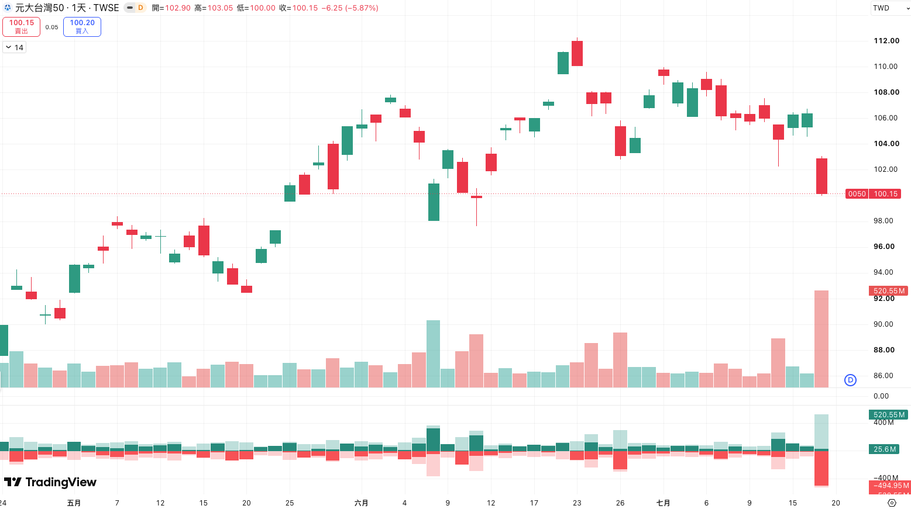

import BookmarkCard from '../../../../components/BookmarkCard.astro';

前一天的收盤價（Close）與隔天的開盤價（Open）之間出現空間不連續的現象，在技術分析中被稱為「跳空缺口（Price Gap）」。

為什麼在收盤到隔天開盤這段「沒有連續交易」的時間裡，價格會突然發生跳躍？這背後主要由**資訊不對稱、盤後衍生性市場**2大核心原因所驅動：

## 原因一：資訊不對稱、盤後衍生性市場

簡單說就是在沒開盤的這段期間，因為
* 新情報、新聞
* 夜間的美股市場行情

等原因影響到今日台股的決策，在開盤前競價時，會決定交易價格。

## 原因二：開盤「集合競價」機制

* 不同於 → 盤中的連續交易： 盤中只要有人買一單、有人賣一單，滑鼠點一下就成交，價格是像水流一樣連續的。

* 早盤開盤的集合競價： 每天早上 08:30 到 09:00 開盤前，台股不進行任何成交，只接受大家掛單進去。到了 09:00 開盤的那一瞬間，交易所的電腦會把這半小時內「所有人累積的買單與賣單」進行一次性的大數據撮合，找出一個「能讓成交量最大化」的單一價格，這個價格就是當天的「開盤價」。

* 不平衡的下場： 如果半夜發生了巨大利空（例如上週五前夕的總經利空），早上 9 點一到，電腦一算發現市場上有 50 萬張「不計代價想賣出」的單子，但卻只有 500 張買單。為了成交，開盤價就必須被迫向下跳躍幾百元去對接買方的防線，這就形成了你看到的「跳空」。

