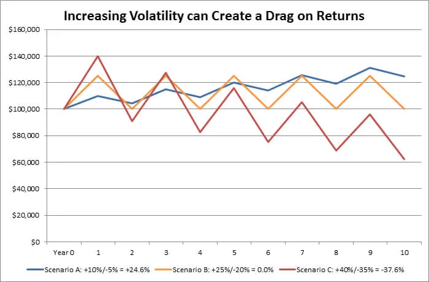

import BookmarkCard from '../../../../components/BookmarkCard.astro';

參考、對比文章：
* <BookmarkCard href="https://chmfia.org/stock-investing-mistakes-guide/" />
* <BookmarkCard href="https://www.fund.gov.tw/News_Content.aspx?n=3268&s=15217" />
* 👍 <BookmarkCard href="https://www.swanglobalinvestments.com/volatility-drag/" />

---

:::tip[閱畢測驗 TEST！]

Q1：你的股票從 100 元跌到 50 元（-50%），之後要漲多少 % 才能回本？

+100%（股價要翻倍回到 100 元）。虧損是不對稱的——跌得越深，回本難度加速惡化，這就是為什麼虧損要在還小的時候處理，不能凹到深套。

Q2：小華今年做 4 筆交易，3 筆各賺 5% 就跑，1 筆虧 35% 死抱，勝率高達 75%，請問他全年是賺是賠？這說明什麼？

賠（每筆 25 萬計算：+12,500 × 3 − 87,500 = 淨虧 50,000）。說明勝率不是獲利關鍵，「賺賠比」才是——贏三次不夠賠一次。正確做法剛好相反：砍掉虧的、抱住賺的。

Q3：你買的股票還在強勢上漲中，也超過原本的目標價了，該立刻停利嗎？

不該。股票還在漲就不要主動下車，改用「移動停利」——停損點隨股價上漲往上移（只上移、不下移），等走勢自己轉弱（如跌破 10 日線、爆量長黑）再出場。停利的觸發條件是「走勢壞掉」，不是「我賺夠多了好可怕」。

:::

# 停利、停損：短線投資人最重要的兩堂數學課

你買股票是為了賺錢，不是為了「證明自己是對的」。但大部分初學者的下場都一樣：**賺 5% 就跑，虧 30% 死抱。**

在分別細說停損、停利之前，先看懂它們倆聯手要對抗的是什麼——一個對所有玩家天生不利的數學陷阱。

---

## 1. 停損×停利，聯手扭轉一場必輸的賽局

### 隨機波動就是虧損

Volatility Drag（波動率損耗）的概念很重要。

做一個最公平的假設：一檔股票每天不是漲 10% 就是跌 10%，機率各半（跟擲硬幣一樣）。你帶 100 萬進場，玩兩天：

- **先漲後跌**：100 萬 → 漲 10% 變 110 萬 → 跌 10% 變 **99 萬**
- **先跌後漲**：100 萬 → 跌 10% 變 90 萬 → 漲 10% 變 **99 萬**

順序不重要——只要一漲一跌幅度相同，本金就蒸發 1%。連玩 20 天（10 天漲、10 天跌），100 萬只剩約 **90.4 萬**。勝率明明有 50%，錢卻一直不見。這就是「波動率損耗」（Volatility Drag）：**放任資產隨機波動、頻繁追高殺低的人，長期注定輸給數學。**

### 用「停損/停利」打敗 Volatility Drag

能長期賺錢的操盤手，靠的不是更高的勝率，而是用兩個武器強行打破上面的公式：

**武器一：停損——切斷大額虧損。**
虧損是不對稱的：虧 50% 要賺 100% 才能回本（幾乎不可能），虧 10% 只要賺 11%（一檔強勢股隨便就有）。高手把每次虧損強制截斷在淺水區，永遠不讓本金掉進「回本無望」的深淵。

**武器二：停利——拉高賺賠比（Risk-Reward Ratio）。**
假設勝率一樣只有 50%，但立下紀律：看錯 **-5% 強制停損**、看對 **+15% 才分批停利**（賺賠比 3:1）。做 10 筆交易（5 對 5 錯）：

- 看錯的 5 筆：5 × (−5%) = −25%
- 看對的 5 筆：5 × (+15%) = +75%
- 合計：**+50%**

同樣是擲硬幣等級的勝率，賽局卻被扭轉成「大賺小賠」的穩贏系統。

> **獲利 =（勝率 × 平均獲利）−（敗率 × 平均虧損）**

勝率你控制不了（沒人能每次看對），但**停損把「平均虧損」鎖小、停利把「平均獲利」拉大**——這兩個變數完全在你手上。

### 設幾 %？波動大小關係

更反直覺的是：**就算「平均報酬」是正的，波動太大照樣賠錢。** 三個組合都是一年漲、一年跌交替，平均報酬通通是每年 +2.5%：

| 情境 | 逐年輪流 | 平均報酬 | 長期實際結果 |
|------|---------|---------|------------|
| A（低波動） | +10% / −5% | +2.5% | 賺錢（每兩年 +4.5%） |
| B（中波動） | +25% / −20% | +2.5% | 損益兩平（1.25 × 0.80 = 1） |
| C（高波動） | +40% / −35% | +2.5% | 虧錢（1.40 × 0.65 = 0.91） |

雖平均報酬（算術平均）一模一樣，但波動越大、結局越慘。

原因是：你直覺算的是「算術平均」（相加除以次數），但你的錢實際長的是「幾何報酬」（一期乘一期的複利）——波動越大，兩者的差距越大，那個差距就是被損耗吃掉的錢。記住兩條規則：**波動越大，損耗越重；抱越久，差距越明顯。**

`Source: Swan Global Investments`

---

## 2. 停損

### 虧損試算

很多人以為「跌 20%，之後漲 20% 就回來了」。錯。假設你有 100 萬：

| 虧損幅度 | 剩餘資金 | 要漲多少才回本 |
|---------|---------|--------------|
| -10% | 90 萬 | +11.1% |
| -20% | 80 萬 | +25% |
| -30% | 70 萬 | +42.9% |
| -50% | 50 萬 | **+100%** |
| -70% | 30 萬 | **+233%** |

**跌得越深，回本的難度是加速惡化的。** 跌 10% 只要一根漲停多一點就回來；跌 50% 要股價翻倍——你這輩子抓過幾次翻倍股？「小賠要砍、大賠不能等」不是心理學，是純數學。

### Before & After：同樣連錯三次

假設你連續 3 次看錯（短線交易很常見），每次全額投入，本金 100 萬：

| | 不停損（每次套 -30% 才認賠） | 紀律停損（每次 -10% 出場） |
|---|---|---|
| 第 1 次失誤後 | 70 萬 | 90 萬 |
| 第 2 次失誤後 | 49 萬 | 81 萬 |
| 第 3 次失誤後 | **34.3 萬** | **72.9 萬** |
| 要回到 100 萬需漲 | +191% | +37% |

同樣是「連錯三次」，一個近乎畢業，一個還活著、還有子彈。**停損的本質不是認輸，是控制單次錯誤的殺傷力，讓你錯得起。**

### 初學者的兩種典型死法

- **死抱不放（「不賣就不算賠」）**：小明 100 元買 10 張，跌到 90「等回本」、跌到 80「賣太可惜」、跌到 65「算了當存股」。帳上虧 35 萬、資金卡死一年；同期大盤漲 30%，機會成本再賠一筆。「不賣就不算賠」是自我安慰，你的購買力已經實實在在縮水。
- **被洗出場（沒有計畫的停損）**：小美追高買在 130、隔天回檔嚇到砍在 118（-9%）；轉頭追下一檔買在 85、又嚇砍在 78（-8%）。兩次「小虧」加手續費，資金少了近 18%。**沒有計畫的停損不叫紀律，叫被洗**——停損點要在「買進之前」就決定好，不是被盤面嚇出來的。

### 停損的正確心態

1. **停損是換位置，不是輸。** 你只是把資金從一檔走弱的股票，移到下一個更好的機會。錢沒有義務在原地等回本。
2. **買進理由消失，就是賣出理由。** 你當初是為了「漲價題材、營收成長」買的，如果題材破功、營收開出來很爛，抱著它幹嘛？
3. **股票不知道你的成本。** 市場根本不在乎你買在哪。唯一該問的是：「如果我今天空手，我還會買它嗎？」不會，就賣。
4. **先想虧多少，再想賺多少。** 進場前就寫下停損價、停利目標。賺賠比至少 1:2（願意虧 10%，就要看得到 20% 以上的空間），否則不要進場。

### 什麼情境該停損？

**短線交易（本文設定主軸）：**

- 跌破你進場前設好的停損價（例如 -8%～-10%，或跌破關鍵支撐、月線）→ **無條件執行，不要凹**
- 買進理由消失：漲價題材被打臉、營收不如預期、族群領頭羊崩了 → 即使還沒到停損價，也該走
- 買進後橫盤太久不動（例如兩三週），資金效率差 → 時間停損，換股

**你還看漲，但股價一直跌？**
短線交易的答案很殘酷：**價格就是裁判。** 你「覺得」會漲不重要，市場用真金白銀投票說你錯了。先出場，看法對了它站回來再買回，多付一點手續費買保險，遠好過套 30%。

**長期投資（順帶一提）：**
如果是基本面存股，停損看的不是股價，是「公司有沒有壞掉」——商業模式被取代、毛利率永久下滑、產業地位消失，這種要砍；單純景氣循環回檔則另當別論。但注意：**不要用「改當長期投資」來合理化短線套牢**，那是初學者最常見的自欺。

---

## 3. 停利

停利的大敵和停損相反：停損是「該砍不砍」，停利是「太早下車」。

最典型的死法叫「處分效應」：小華一年做 4 筆交易、每筆 25 萬，3 筆各賺 5%～6% 就緊張落袋，1 筆 -35% 死抱不賣。**勝率 75%，全年倒虧 47,500 元**——贏三次不夠賠一次，問題不是選股能力，是賺賠比壞掉了。

### 小賺5%就急著跑 vs 確保利潤空間

兩個人都用 100 萬做短線，一年各做 10 筆，勝率同樣 6 成：

| | 小賺就跑型 | 賺賠比管理型 |
|---|---|---|
| 賺的 6 筆 | 每筆 +5% | 每筆 +20%（讓利潤跑） |
| 虧的 4 筆 | 每筆 -10%（有停損） | 每筆 -10%（有停損） |
| 每 10 筆合計 | 6×5% − 4×10% = **-10%** | 6×20% − 4×10% = **+80%** |

**同樣的勝率、同樣的停損紀律，只差在「賺的時候敢不敢抱」，結果一個賠一個大賺。** 短線獲利的來源，往往就是一年裡那兩三次抓對主流族群的大波段；每次 +5% 就落袋，等於自己把大魚剪線放走，只留小蝦米。

### 停利的正確心態

1. **停利不是猜最高點，是保護已到手的利潤。** 沒有人賣得到最高點，能吃到魚身（中間 60%～70% 的波段）就是贏家，魚頭魚尾留給別人。
2. **用「移動」的方式停利，不用「固定」的目標價。** 股票還在強勢上漲時不要主動下車，讓它漲；等它自己轉弱再走。
3. **賺錢的部位是你的資產，不是你的風險。** 很多人把獲利部位當燙手山芋急著賣、把虧損部位當寶死抱——**正確做法完全相反：砍掉虧的，抱住賺的。**

### 什麼情境該停利？

**短線交易：**

- **趨勢轉弱訊號**：跌破 10 日線／20 日線、爆量長黑、族群集體轉弱 → 走
- **移動停利觸發**：從波段高點回落超過你設的幅度（例如 10%～15%）→ 走
- **利多鈍化**：好消息出來股價不漲反跌（例如漲價信、財報都出了，股價卻軟掉）→ 代表利多已反映完，走
- **達到你進場前設定的目標價、且動能減弱** → 可分批走
- **市場過熱訊號**：人人都在討論這檔、融資暴增、連你完全不看股票的朋友都問你 → 通常是波段後段，開始分批走

**還在看漲、股票也還在漲？**
那就**不要停利**，改用「移動停損」保護獲利（下一段講）。停利的觸發條件應該是「走勢壞掉」，不是「我賺夠多了好可怕」。

---

## 4. 資深投資人的實戰技巧

### 2% 法則：用部位大小控制風險，而不只是停損價

單筆交易的「最大虧損金額」不要超過總資金的 2%。

算法：總資金 100 萬 × 2% = 最多虧 2 萬。
如果這檔股票你的停損設 -10%，那部位上限就是 2 萬 ÷ 10% = **20 萬**。

這樣就算連錯 5 次，也只傷 10% 本金。部位控管才是活得久的核心，停損價只是執行工具。

### 移動停利（Trailing Stop）：讓賺錢的單自己決定何時下車

買進 100 元，設初始停損 92。

- 漲到 115 → 停損上移到 105（保住 +5%）
- 漲到 130 → 停損上移到 117（保住 +17%）
- 漲到 150 後回跌，觸發 135 出場 → 吃到 +35%

停損點只往上移、永不下移。這招同時解決「太早停利」和「獲利變虧損」兩個問題。

### 分批進出，不做全有全無

- 停利：漲到第一目標先賣 1/3 或 1/2，剩下的用移動停利抱波段。心理壓力小很多，也不會空手看它續噴。
- 進場：先試單 1/3，走勢證明你對了再加碼。**只加碼賺錢的部位，永遠不要攤平虧錢的部位**——攤平是把資金加倍押在「已被證明是錯的判斷」上。

### 停損設在「技術位置」，不是隨便一個整數

比起「無腦 -10%」，更好的做法是設在關鍵支撐之下：前波低點、起漲缺口、月線下方一點點。跌破這些位置代表多方結構真的壞了，而不是正常洗盤把你洗掉。設好之後直接掛預約單（觸價停損），不給自己臨場猶豫的機會。

### 進場前寫交易計畫，出場後寫交易日誌

一張單三個數字：進場價、停損價、目標價，賺賠比不到 1:2 就放棄這筆。出場後記錄「當初為什麼買、為什麼賣、有沒有照計畫」。三個月後回頭看，你會發現虧最多的單，幾乎都是沒照計畫的那幾筆。

### 認清自己的天敵是「凹單」

老手和新手最大的差別不是選股，是：老手停損單筆平均 -8%，新手平均 -25%。長期下來，光這一項就決定了誰能留在市場。

---

## 結語

小賠、小賺、大賺、絕不大賠——做到這 12 個字，就算勝率只有五成，長期也是賺的；反過來，賺 5% 就跑、虧 35% 死抱的人，勝率 75% 照樣畢業。

先學會怎麼輸，才有資格贏。

---

*本文為教學性質的一般資訊，非投資建議。所有數字為簡化試算（未計手續費與交易稅），實際投資請依自身風險承受度評估。*
