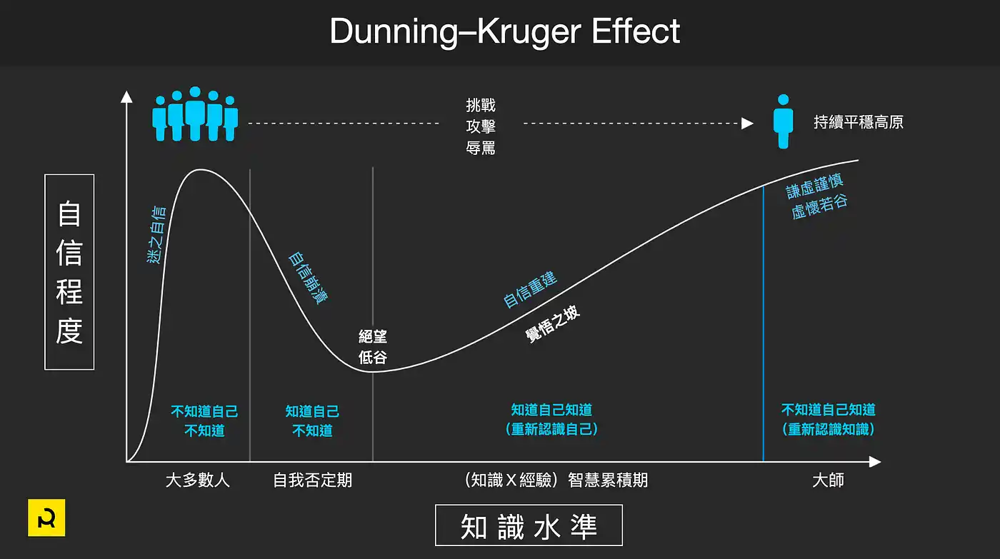
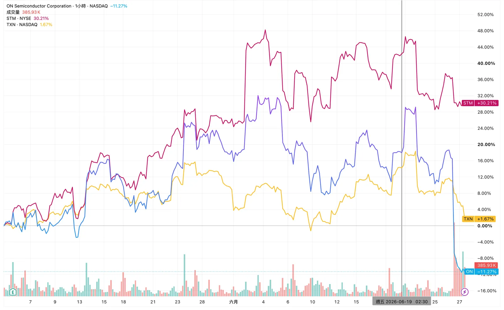
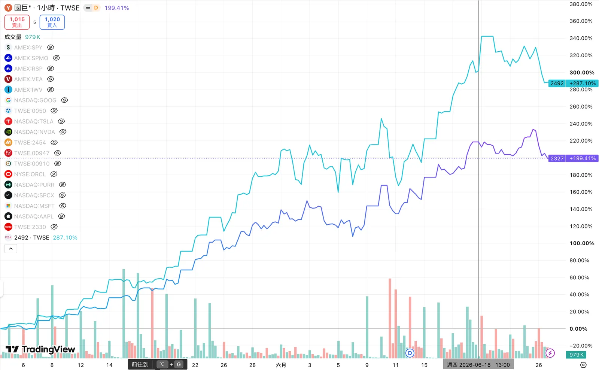
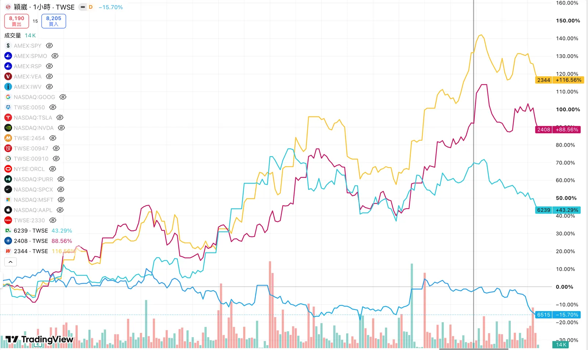
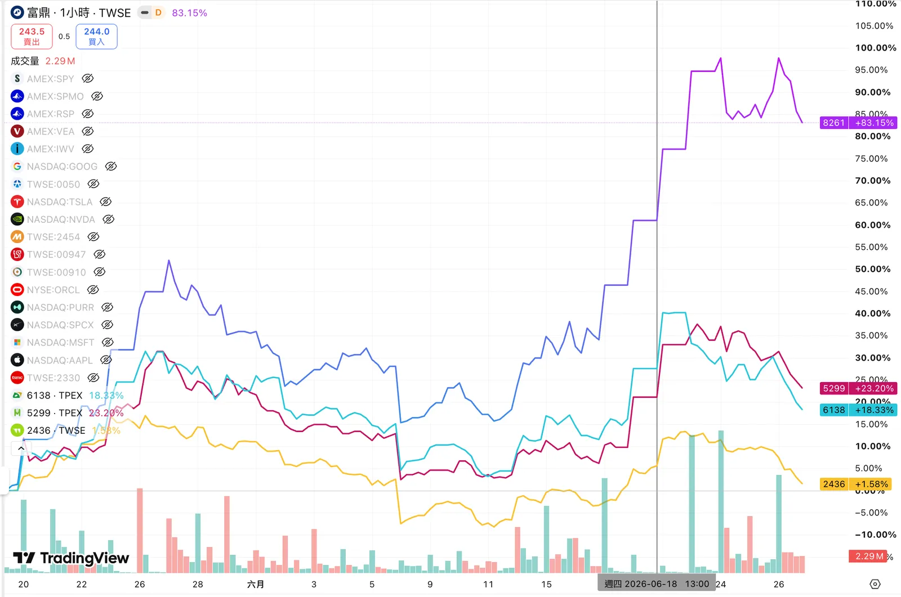
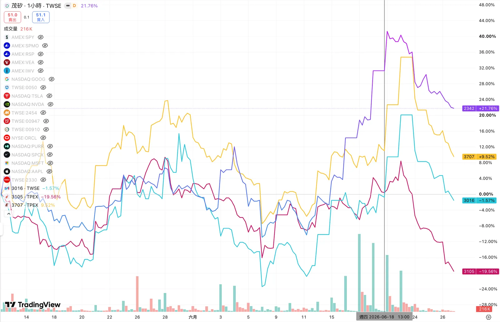

import DocLink from '../../../../components/DocLink.astro';
import { Aside } from '@astrojs/starlight/components';

<Aside type="caution" title="期待那天你不再需要預防針">
以下內容不構成投資建議，請審慎評估。愚昧之巔⬇️

</Aside>


---

<a href="https://www.google.com/search?q=%E8%82%A1%E7%99%8C+672" target="_blank" rel="noopener noreferrer">🔍 Google "股癌 672"</a>

<br/>
<br/>

本集更新於：**2026.6.19**

圖表更新於：**2026.6.27**


## 第一段（1-5 條）延伸解析
```java wrap
1. 前面數集就有提到了：看到IDM漲價，像是德州儀器、STM、安森美

2. 被動元件開始出現震盪後，往下一個機會去看，市場很多資金也是這樣做

3. 集體表態注意：即便自己判斷是偏向亂跟漲的假貨，後面的發展可能出乎意料，就像是HBM最缺，結果DDR5毛利率最高

4. 不是孟恭喊的盤：IDM上周就噴出了，這是國際現象，全球在動，只是自己比較敏銳，觀察並分享出來

5. 業內前端消息：類似被動元件，雖然高端用量好價格高，但台灣的應該還好

6. 工廠端回饋：要去拿歐美一供的東西拿不到，lead time超高，只好去找二三供或台灣就近的高壓Mosfet、伺服器Mosfet
```


### 1. IDM 漲價：德州儀器、STM、安森美

**IDM** = Integrated Device Manufacturer，垂直整合元件製造商，自己設計又自己生產。

| 公司 | 代號 | 國籍 | 專長 |
|------|------|------|------|
| 德州儀器 | TXN（美股） | 美國 | 類比晶片、工業用IC |
| STMicroelectronics | STM（美股）| 歐洲（法義） | 微控制器、功率元件 |
| 安森美 | ON（美股） | 美國 | 電源管理、車用半導體 |

這三家漲價代表**工業/車用半導體供給吃緊**，是景氣回升的早期信號。


---

### 2. 被動元件

指電阻、電容、電感這類基礎零件，台灣主要廠商：

| 公司 | 代號 | 專長 |
|------|------|------|
| 國巨* | 2327 | MLCC電容龍頭 |
| 華新科 | 2492 | MLCC |
| ~~奇力新~~ (2021已下市) | ~~2456~~ | ~~電感~~ |
| 禾伸堂 | 3026 | 被動元件通路 |

「被動元件震盪後資金往下一個機會移動」→ 這是**板塊輪動**的概念，被動元件漲完，資金找下一個還沒漲的標的。

<DocLink target="_blank" slug="posts/finance-reports/supply-chain-passive/#各環節上市公司" /> （國巨*、華新科）


---

### 3. HBM vs DDR5

| 標的 | 說明 |
|------|------|
| **HBM** | 高頻寬記憶體，AI GPU專用，SK海力士/三星生產，台灣受益股如**穎崴（6515）、力成（6239）** |
| **DDR5** | 一般伺服器/PC用記憶體，**南亞科（2408）、華邦電（2344）** |

重點在說：**市場預期最缺的不一定最賺**，DDR5 毛利率反而更高，這提醒你不要只追熱門題材，要看實際獲利結構。


<DocLink target="_blank" slug="posts/finance-reports/supply-chain-semiconductor/#各環節上市公司" /> （穎崴、力成、南亞科、華邦電）


---

### 4. IDM 是國際現象

呼應第1點，說這波 IDM 漲價不是台灣單一現象，是全球在動，代表這個信號可信度高，不是被人為炒作出來的。

---

### 5. 被動元件業內消息

高端被動元件（車用、工業級）需求好、價格高，但**台灣廠商受影響程度有限**，暗示台灣被動元件股不一定跟漲，要謹慎。

---

### 6. 高壓 Mosfet、伺服器 Mosfet

這是最具體的供給吃緊信號。

**Mosfet** = 金屬氧化物半導體場效電晶體，功率元件，用在電源控制。

歐美一線供應商（IDM）交期拉長（lead time 超高）→ 客戶被迫找二三線或台灣廠商，台灣相關標的：

| 公司 | 代號 | 專長 |
|------|------|------|
| 富鼎 | 8261 | Mosfet |
| 茂達 | 6138 | 電源管理IC、Mosfet |
| 杰力（上櫃） | 5299 | Mosfet |
| 偉詮電 | 2436 | Mosfet、電源IC |

[富鼎](https://ic.tpex.org.tw/company_chain.php?stk_code=8261)所屬產業鏈：
* 半導體 > 電源管理IC
* 電動車輛產業 > 電動汽車、電動機車、電動自行車
* 能源元件 > 原材料




---

## 整體趨勢邏輯

```java wrap
歐美IDM漲價、交期拉長
        ↓
客戶轉單台灣功率元件廠（Mosfet）
        ↓
被動元件同步受惠（電容電感用量增加）
        ↓
資金開始輪動進這些台灣中小型半導體股
```

### 補充：「訂單」一定會影響「股價」？兩者的關係性

```
① 訂單增加（需求真實發生）
        ↓ 【要看1：訂單能否轉成營收？】
② 營收成長（要看產能、良率、交期）
        ↓ 【要看2：營收能否轉成獲利？】
③ 毛利率提升（要看議價權，這是關鍵）
        ↓ 【要看3：獲利能否持續？】
④ EPS 成長（要看是一次性還是結構性）
        ↓ 【要看4：市場願意給多少估值？】
⑤ 股價上漲（本益比 × EPS）
```

## 第二段（6-11條）延伸解析

這段話的核心邏輯是**轉單效應**，歐美供給吃緊，台灣是受益方。你關注的順序應該是：先看 IDM 漲價幅度和交期，再看台灣對應廠商的接單狀況。

```java wrap
7. 類似記憶體，功率半導體最缺最旺的東西落在歐美，但AI導致排擠效應

8. 族群輪動：市場專注力有限，而題材太多，沒空注意其他題材，直到某族群休息之後，才會再走到另一個東西去

9. PMIC、Mosfet機會：lead time變高、價格上漲，再來要考慮的是產能，IDM直接看稼動率就好，沒有自己廠房的要看是否搶得到產能，6吋8吋代工廠股價也相對強勢

10. 漲價：注意議價權比較大的，可能是在設計端或其他

11. 當族群性發生時，一堆法人衝進去，盯的人夠多，研究力量都在這邊，若是假貨的話，會立刻A下來

```

<DocLink target="_blank" slug="posts/finance-reports/tsmc-26q1/#revenue-by-platform" />


### 7. 功率半導體最缺在歐美，AI 排擠效應

意思是：晶圓廠產能有限，AI 晶片（邏輯製程）優先級最高，排擠了功率半導體的產能。

```
晶圓廠總產能固定
AI晶片需求暴增 → 吃掉大量產能
→ 功率半導體產能被壓縮
→ 歐美IDM自己廠房不夠用
→ 缺貨、漲價、交期拉長
```

這解釋了為什麼第6條說「拿不到」——不是需求不好，是**產能被AI排擠**。

---

### 8. 族群輪動

這是股市資金的基本運作邏輯：

```
市場注意力有限
→ AI題材吸走所有目光
→ 功率半導體/被動元件沒人理
→ AI族群漲多休息
→ 資金才流向下一個題材
```

這段在說：**現在可能就是資金開始注意功率半導體的時間點**，因為AI族群已經漲一段了。

---

### 9. PMIC、Mosfet 機會：選股邏輯

這條最實用，給了具體的選股框架：

| 公司類型 | 看什麼指標 |
|---------|-----------|
| **IDM**（自有廠房） | 看稼動率，稼動率高 = 產能滿載 = 有議價權 |
| **Fabless**（無自有廠） | 看能否搶到代工產能，搶不到就算訂單來也沒用 |
| **6吋8吋代工廠** | 股價已相對強勢，是間接受益標的 |

**PMIC** = Power Management IC，電源管理晶片，跟 Mosfet 同屬功率半導體族群。

台灣相關代工廠（6吋8吋）：

| 公司 | 代號 | 說明 |
|------|------|------|
| 漢磊（上櫃） | 3707 | 6吋功率半導體代工 |
| 嘉晶 | 3016 | 6吋化合物半導體 |
| 穩懋（上櫃） | 3105 | 化合物半導體代工 |
| 茂矽 | ~~6266~~ 2342 | 8吋功率半導體代工 |



* 嘉晶、茂矽：<DocLink target="_blank" slug="posts/finance-reports/supply-chain-semiconductor/#中游晶圓製造設備光罩化學品" />
* [3707 漢磊](https://ic.tpex.org.tw/company_chain.php?stk_code=3707)（上櫃）產業鏈:
    * 半導體 > IC/晶圓製造
    * 半導體 > 晶圓製造
    * 半導體 > DRAM製造
    * 半導體 > 其他IC/二極體製造
* [3105 穩懋](https://ic.tpex.org.tw/company_chain.php?stk_code=3105)（上櫃）產業鏈:
    * 半導體 > 晶圓製造
    * 太空衛星科技 > 天線/射頻基頻

* <DocLink target="_blank" slug="posts/articles/listed-otc-emerging" /> 6/26 成交量作爲參考：漢磊（上櫃、2512w）、嘉晶（上市、882w）、穩懋（上櫃、3380w）、茂矽（上市、259w）<br/>→ `蝸牛觀點`：這數據看來，上櫃公司的成交量反而遠多於上市，交易量多代表流通率較好，評估時看`生產內容等基本面`的重要性，會大過於上市、櫃之別。

---

### 10. 漲價：議價權在誰手上

「設計端議價權大」的意思是：

如果客戶**只能用你設計的規格**（無法輕易換供應商），你就有定價權。反之，規格通用的產品競爭激烈，漲價能力弱。

選股邏輯延伸：
> 找那些客戶**換不掉**的台灣廠商，比找最便宜的更重要。

---

### 11. 族群性發生時法人集中火力

這條在說一個市場機制：

```
族群題材確立
→ 法人大量研究、買進
→ 如果是假貨（基本面撐不住）
→ 法人研究力道會很快識破
→ 股價迅速崩跌（A下來）
```

反過來說：**如果法人進來之後股價撐住沒跌，代表基本面是真的**，信號可信度提高。

---

## 第三段：消費性＋車用「滿鳥」的重要性

```java wrap
(三)、好險消費性跟車用在滿鳥的狀態

1. 如果消費性跟車用很好的話，這波通膨巨浪會很恐怖

2. 價格有其上限：還沒到那個位置就需求破壞了

3. 有些負面的因素反而導致這波走得更長遠

4. 若這兩個領域都站起來去搶料的話，對市場造成的供需影響是什麼

5. 觀察：誰能手握產能?誰能手握不計代價搶貨的客戶?
```

「滿鳥」= 台語，意思是很差、很爛的狀態。

### 1-2. 消費性＋車用弱是這波的保護傘

| 情境 | 結果 |
|------|------|
| 消費性＋車用**同時強** | 全面搶料 → 通膨巨浪 → 價格飆到需求破壞 |
| 消費性＋車用**持續弱** | 只有工業/AI在搶料 → 漲價幅度有限 → 行情走得更長 |

這是一個反直覺的觀點：**某個領域的弱，反而讓整波行情更健康、更持久。**

---

### 3. 負面因素反而讓行情更長遠

呼應上面，消費性車用弱 = 沒有過熱的搶料潮 = 不會快速到達需求破壞點 = 漲價循環可以持續更久。

---

### 4-5. 核心觀察框架

這兩條給出了這波行情最重要的兩個問題：

**問題一：誰能手握產能？**
- 自有廠房的IDM
- 提前鎖定代工產能的Fabless
- 6吋8吋代工廠本身

**問題二：誰手握不計代價搶貨的客戶？**
- 客戶是軍工、醫療、關鍵基礎設施 → 價格敏感度低，願意付溢價
- 客戶是消費性電子 → 價格敏感，能拖就拖

---

## 🔶整段的核心投資邏輯總結

```
AI排擠功率半導體產能
+ 歐美IDM交期拉長
+ 消費性/車用尚未復甦（不搶料）
↓
功率半導體供給吃緊但需求結構健康
↓
台灣轉單受益：Mosfet、PMIC、6吋8吋代工廠
↓
選股關鍵：
① 有產能（IDM稼動率高 or Fabless搶到代工）
② 有議價權（設計獨特、客戶換不掉）
③ 客戶是不計代價搶料的產業
```

這段分析的邏輯非常完整，從供給端（產能被AI排擠）→ 需求端（消費/車用弱保護行情）→ 選股框架（產能＋議價權），是一套可以直接用來篩股的思路。


## (6/23)觀察
6/23 週二美股開盤走低，受到全球科技股拋售拖累，輝達早盤跌3.2%、美光暴跌11.4%、台積電跌5.2%，VanEck半導體ETF（SMH）下跌6.5%，整個半導體類股全面承壓。 

往前一天看，亞洲市場全面收黑，南韓KOSPI暴跌9.99%，創三個多月最大跌幅，海外投資人在監管signal暗示半導體漲勢過熱後拋售晶片股，三星和SK海力士各跌超過12%，觸發交易所盤中自動暫停交易20分鐘。 

```markdown wrap
前因：半導體年初漲79.3%，估值過高（火藥庫）
   +
6月初博通財測miss，已有一次1.3兆崩盤（餘震未消）
        ↓
觸發：南韓監管signal暗示漲勢過熱
        ↓
亞洲記憶體股崩（KOSPI -9.99%，三星/海力士 -12%）
        ↓
傳導到美股開盤（美光 -11%、台積電 -5%、SMH -6.5%）
        ↓
ETF機械式贖回 → 類比/功率族群連坐
        ↓
TXN -6.7%、ON -7.8%、ADI、NXPI、MCHP 全跌
        ↓
資金轉進防禦股（IBM、PSA、Accenture 逆勢漲）
```

### 為什麼 TXN/ON/ADI 特別慘？
這三檔是「類比/功率」族群，跟記憶體不同，但在這種系統性賣壓下會被一起拖下水，原因有三：
1. ETF 連坐效應<br/>
SMH 等半導體 ETF 一被贖回，成分股不分基本面好壞全部被機械式賣出。
2. 估值同樣偏高<br/>
TXN 年初至今曾大漲75.7%，ADI 漲46.8%，兩者的forward sales multiple都顯著高於過去一年的中位數。 漲多的股票，回檔時跌得也兇。 
3. 板塊輪動：資金從成長股流向防禦股<br/>
6/23同一天，防禦型和軟體類股逆勢上漲，Public Storage漲4.4%、IBM漲4.2%、Accenture漲3.3%。 這是典型的資金從高估值成長股撤出、轉進防禦資產的輪動。 

### 小結：「新聞與股價的因果」問題
這正好呼應你之前問的「新聞與股價的因果」問題，這是一個教科書級的案例：

這次下跌跟 **TXN/ON/ADI 的基本面無關**。 它們的 AI 資料中心營收還在高速成長（TXN 資料中心 Q1 年增 90%），但股價照跌。這證明了短期股價是被**板塊情緒和資金流**主導，不是基本面。

多數分析師的看法是：這次拋售被視為**估值重置**（valuation reset）而非基本面崩壞，**多數分析師認為AI基礎設施支出依然強勁，資料中心營運商持續大規模投資**。 

所以從你之前建立的選股框架看：如果你認同這些公司的「產能＋議價權＋客戶」三條件沒變，那這種系統性下跌反而可能是技術性修正而非基本面破裂的進場觀察點。但要注意，沒有人能確定這波修正是否結束——6月初那次跌完幾天就反彈，這次會不會一樣，沒人知道。 

⚠️ 以上為因果推論與資訊整理，不構成投資建議。**系統性風險下的「逢低承接」有相當風險，請審慎評估**。