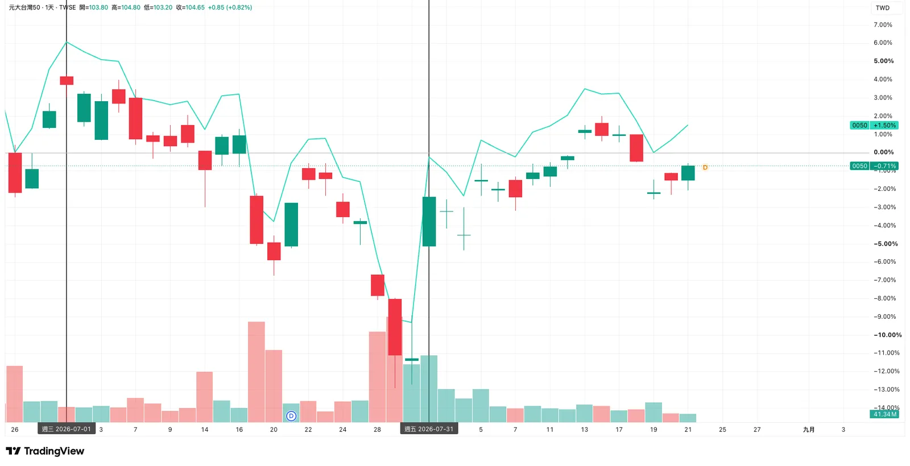
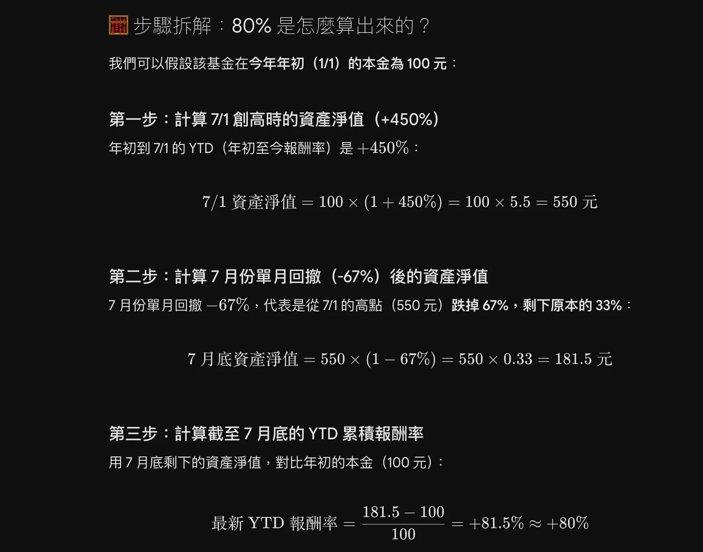
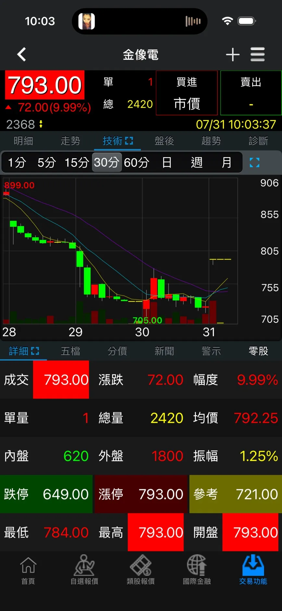
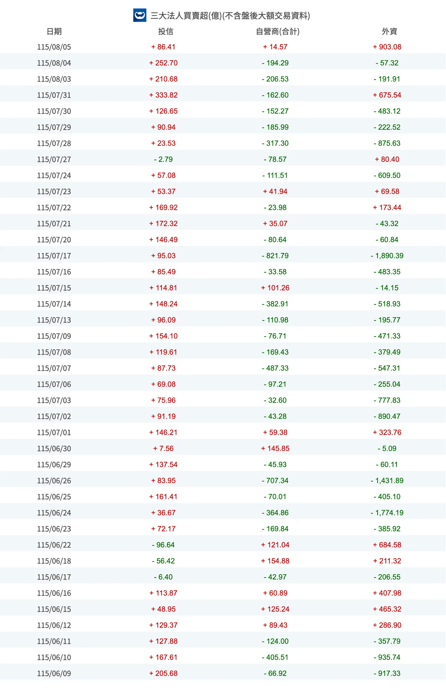
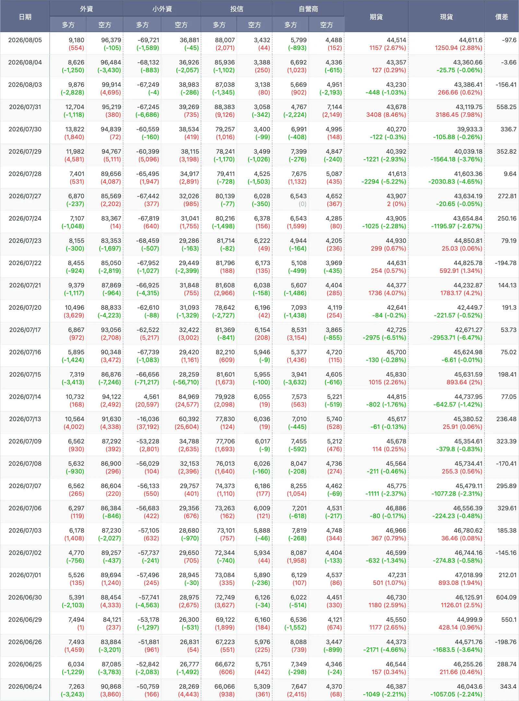

import BookmarkCard from '../../../../components/BookmarkCard.astro';
import { Card } from '@astrojs/starlight/components';
import DocLink from '../../../../components/DocLink.astro';


<Card title="蝸牛看法" icon="star">
7/17 有發現外資資金移出（賣超 - 1,890.39）[三大法人買賣超金額統計表](https://stock.wearn.com/fundthree.asp)，導致當日跌幅 -6%。7/17 除了剛台積法說會完（可能有一批人獲利了結），美股半導體（ETF: SOXX, SMH 下圖）也在當天大跌，所以這不僅是台股現象而已。

> ➡️ <DocLink slug="posts/noun-explanation/taiex-futures/#實戰以-26717-崩盤6為例" />

而外資也在 7/17 移出台灣，可能也牽扯到 Leopold Aschenbrenner 基金事件，資金打算等待時機（最後到7月底）要去撿那塊餅也說不定。

總之，會看籌碼面蠻重要的。
</Card>

這是 7 月最重要的一條「隱藏因果線」——你在 7/14–7/17 看到的台股崩盤、以及 7/31 看到的全面漲停，跟這個基金的死亡螺旋是**同一個事件的兩面**。我先把故事講清楚，再列新聞與技術面數據，最後誠實標注哪段因果是確定的、哪段是推測。

<BookmarkCard href="https://socialworkerdaily.com/notes-of-gooaye-ep-684/" /> 

---

## 一、主角是誰、他做了什麼交易

Leopold Aschenbrenner 是前 OpenAI 研究員，19 歲以第一名畢業於哥倫比亞大學，2024 年發表 165 頁的《Situational Awareness》宣言後成立同名對沖基金，主張 AGI 將帶動晶片、記憶體、資料中心、電力的巨大需求。基金到 2026 年 6 月底費後報酬約 439%，資產一度膨脹到 450 億美元，槓桿高達約 4 倍（400%）。

他的部位結構是：**做多 AI 基建**（公開申報持股包括 Nebius、Bloom Energy、Sandisk、CoreWeave、IREN 等，以及 SK 海力士）＋**放空被 AI 顛覆的軟體股**（如 Adobe）。

注意這個結構——跟你 7 月看的台股主流族群（記憶體、AI 伺服器、功率元件、PCB）是**同一個 trade**。

---

## 二、時間軸：把他的爆倉和台股崩盤疊在一起
SALP（Situational Awareness LP）是私募基金/對沖基金：SALP 是一家對沖基金，而非在交易所公開上市交易的「ETF」或「股票」。這類基金的資產淨值（NAV）和持倉是私下對投資人披露的，不會有公開的即時交易代號（Ticker）。


> 0050 日線


| 日期 | 他的基金 (SALP) | 台股／全球 |
|------|---------|-----------|
| 7/1 | 資產達 450 億美元頂峰，YTD +450% | 台股仍在高檔 |
| 7/10 | SK 海力士美國 IPO——事後被視為 AI 板塊的頂部訊號，而它正是基金最大持股之一 | AI 股開始轉弱 |
| 7/10–20 | 全球 AI 股全面殺跌，多數兩週內跌逾 30%；槓桿部位的連環平倉引發南韓股市重挫 | **7/14–15 台股盤中狂殺逾 1,700 點** |
| 7/16 | 部位持續失血 | 台積電法說超標 |
| **7/17** | 重倉部位遭遇重大 mark-to-market loss（帳面損失） | **台股 -2,953 點（-6.47%），史上最大跌點**；聯發科 -8.92%、聯電/國巨/南亞科跌停；全球 semiconductor / AI stocks 同步重挫 |
| 7/24 | 基金致函投資人承認「重大虧損」 | 台股弱勢整理 |
| 7/28–30 | 消息走漏後，其他基金聞血圍獵，其重倉股三個交易日再跌 30%+；被迫求售資產 | 台股持續探底（金像電 7/30 見 705 低點）|
| 7/30–31 | 美銀、高盛、小摩等主經紀商追繳保證金，被迫將**整個公開股票部位一次性打包折價賣給 Citadel**；資產從 450 億剩約 100 億，單月 -67% | **7/31 台股全面漲停**（你當天問的那根無量漲停）；Sandisk、美光等基金重倉股反彈逾 20%，Cramer 稱此為「清算事件，可能標誌 AI 交易的底部」 |


<Card title="蝸牛看法" icon="star">

最早的新聞：
* Jul 30, 9:05 AM <BookmarkCard href="https://www.cnbc.com/2026/07/30/leopold-aschenbrenners-hedge-fund-is-facing-steep-ai-losses.html?&qsearchterm=Leopold%20Aschenbrenner" />
* Jul 30, 9:17 AM EDT <BookmarkCard href="https://www.cnbc.com/video/2026/07/30/star-ai-investor-leopold-aschenbrenner-is-unwinding-trades-after-steep-losses.html?&qsearchterm=Leopold%20Aschenbrenner" />

其他更多是 7/31 才發新聞。

轉發 CNBC 新聞：
* <BookmarkCard href="https://x.com/FT/status/2082842714245075189" /> 
* <BookmarkCard href="https://x.com/InvestingVisual/status/2082835281707741284" /> 

</Card>

---

## 三、因果機制：爆倉如何「傳導」到台股

```
擁擠的 AI 槓桿交易（他 4 倍槓桿、450 億，且全市場對沖基金
槓桿升至 2008 年以來最高、集中在同一批 AI 基建股）
        ↓ 觸發點
SK 海力士 IPO 見頂 + 升息恐慌 + 地緣風險（中東、油價破 80）
        ↓
動能反轉 → 多空雙殺（做多的 AI 股跌、放空的軟體股漲）
        ↓
保證金追繳 → 被迫賣 → 越賣越跌 → 更多追繳（死亡螺旋）
        ↓
賣壓橫掃整個「AI 基建交易圈」：美股、韓股、台股是同一條供應鏈
        ↓
台股端同步發生：外資期貨空單墊高、現貨提款、本地融資斷頭
        ↓ 7/17 恐慌高潮
7/30–31 整批部位一次性出清給 Citadel = 強制賣壓的「終點」
        ↓
賣壓真空 + 空頭回補 → 7/31 台股全面漲停、美股重倉股反彈 20%+
```

**為什麼避震器變成雙面刃：多空雙巴**

第一節那個「做多 AI 基建＋放空軟體股」的結構，本來是設計來互相保護的——一邊跌另一邊漲，淨曝險有限。但**動能反轉**發生時，最擁擠的多單跌最兇、最擁擠的空單被軋最兇：AI 股崩跌讓多單虧，被放空的軟體股反彈讓空單也虧，**兩邊同時輸**。再乘上 4 倍槓桿，兩邊的虧損都放大四倍，保證金瞬間見底。

**去槓桿是三層同時發生的**

而且不是他一個人的事。市場傳言 Point72、Millennium、Citadel 這些多策略巨頭（pod shop，旗下有數十個獨立操盤團隊）底下做動能策略的 pod，這一波同樣被掃。整場去槓桿是三層結構同時進行：**核心**是 Situational Awareness（規模最大、槓桿最高、部位最集中）、**外圍**是各大多策略基金的動能 pod、**最外圈**是散戶槓桿仔——台股的融資斷頭就在這一層。三層一起降槓桿，才做得出史上最大跌點。

🔶**這條線完美解答了你 7/31 那天的疑問**：為什麼台股突然全面漲停、卻「量好像不多」——因為那不是新買盤湧入，而是**強制賣壓消失了**。最大的賣方（被迫去槓桿的基金群）在 7/30–31 完成出清，市場俗稱「clearing event」（清算事件）：該賣的賣完了，惜售之下自然無量鎖漲停。

**為什麼「整包賤價賣掉」反而是對的**

看到「折價打包賣給 Citadel」直覺會覺得很慘，但那其實是止血最快的選擇。分批慢慢賣的下場，時間軸裡 7/28–30 那三天已經演過一遍了：消息一走漏，其他基金聞血圍獵，越賣越低。一次出清的代價是折價，換到的是**虧損封頂**。反過來看，Citadel 接下整包後，剛好吃到 7/31 起 Sandisk、美光反彈 20%+ 的另一面。

再往下推一層：如果當時市場流動性更充沛（承接盤更深、買家更多），他根本不必折價這麼多，跌幅也不會這麼深。**流動性不足時，賣壓會自我放大**——這跟比特幣週末插針、台股跌停鎖死賣不掉是同一個物理。

---

## 四、爆倉之後：他還剩下什麼

「爆倉」聽起來像歸零，但用基金業的算法完全不是這回事：7 月單月回撤（drawdown）約 -67%，可是年初到 7/1 的 YTD 是 +450%——兩者相乘，**7 月底的 YTD 仍有 +80% 左右**；從 2024 年成立起算，累計報酬還是一千多趴。


> 「兩者相乘」公式為：$$\text{最新 YTD} = (1 + \text{前段報酬率}) \times (1 - \text{回撤幅度}) - 1$$

所以他不是賠光，是**把今年的暴利吐回去大半**。從成立就跟著他的投資人到現在還是大賺。這裡要修正一個直覺：散戶講的「爆倉」是本金歸零，機構講的「爆倉」是被迫平倉、策略失效——**真正被毀掉的是槓桿部位和聲譽，不是所有本金**。

剩下的約 100 多億美元裡，絕大多數是 **Anthropic 的私募股權**，透過 SPV（特殊目的載體，專門用來持有單一未上市公司股份的工具）持有。這部分賣不掉，反而躲過了追繳。結果是這檔基金的性質整個變了：從 4 倍槓桿的多空對沖基金，變成「**Anthropic 的 SPV ＋ 一個小型 long-only 基金**」。往後想投他的人，本質上是在買一張 Anthropic IPO 前的門票，跟原本那個策略已經沒什麼關係了。

---

## 五、技術面數據對照（你自己一路記錄的）

把你這一個月看過的數據放回這個框架，每一項都對得上：

**籌碼面**：外資期貨淨空單從 7/9 的 80,730 口一路墊高到 7/17 的 86,189 口（歷史極端水位），且崩盤日仍加空——現在你知道了，那不只是避險，背後是全球 AI 槓桿交易的集體去化；期現貨正價差從 7/9 的 +323 點崩到 7/17 的 +53 點——樂觀溢價被抽乾的過程，正是動能反轉的量化足跡。

> ➡️ <DocLink slug="posts/noun-explanation/taiex-futures/#實戰以-26717-崩盤6為例" />

**價格面**：台積電法說超標（7/16）隔天照樣重挫——基本面利多完全擋不住去槓桿賣壓，「無差別下殺」；金像電 899 → 705（-22%）後 7/31 跳空無量漲停。

<div style="width:250px">
> 
7/31 蠻多 AI 熱門標的都長這樣，跳空無量漲停
</div>
**量能面**：7/17 尾盤爆量收最低（恐慌出清）→ 7/31 無量鎖漲停（賣壓真空）——教科書級的「爆量趕底、無量反轉」序列。

---

## 六、誠實的界線：哪段因果是確定的、哪段是推測
<BookmarkCard href="https://socialworkerdaily.com/notes-of-gooaye-ep-684/" /> 

**確定的**：基金爆倉、追繳、整批賣給 Citadel、時間軸與台股崩盤高度重疊——這些有 CNBC、WSJ、FT 多方交叉證實。全球對沖基金槓桿集中於同一批 AI 股、一家大戶平倉會拖垮其他人的系統性結構，也是金融穩定委員會層級點名的風險。

**推測但合理的**：他的 13F 申報持股是美股與韓股（SK 海力士、CoreWeave 等），**沒有直接證據顯示這檔基金大量直接賣出台股**。台股的崩跌是透過三條間接管道：同一供應鏈的估值連動、外資在亞洲整體 AI 部位的同步去槓桿、以及台股本地的融資斷頭放大器。所以精確的說法是：**台股崩盤與他的爆倉是同一場「全球 AI 動能反轉＋去槓桿」的共同結果，且互相強化**，而不是簡單的「他賣爆台股」。

**需存疑的**：第三節點名的那幾家多策略基金動能 pod 是市場傳言，無法驗證；而「這次只是獲利回吐、真正的 AI 大修正還在後面」這類說法屬於預言性質——**沒有時間表的預言永遠不會錯**，講的人自己也說「不認為很快」。

> 3.原先是AI的Long/Short Hedge Fund，做多BE、SDNK、CRWV、MU、SK，空軟體股，多空雙巴被掃出場 

> 6.這次是獲利回吐，後來一定會有一波真正的AI大修正會產生 
---

## 這個事件給你的四個收斂

第一，它把你 7 月所有的觀察串成一條線：**史上最大跌點的「兇手」不是基本面（台積電、聯發科、VRT 財報全都很好），而是槓桿**——這正是 LTCM、Archegos 以來不斷重演的劇本。這裡還藏了一個彩蛋：他那篇 AI 論文對產業方向其實**預測對了**，最後照樣爆倉——**論點正確 ＋ 槓桿錯誤 ＝ 爆倉**。方向對不能保護你，倉位管理才能。

第二，它是「籌碼面領先價格面」的最強案例：外資空單、價差收斂這些你在 7/17就看到的訊號，比 7/24 的基金致函、7/30 的新聞曝光**早了一到兩週**。

第三，留一個警覺：Cramer 說的「清算事件＝底部」歷史上常常對，但**去槓桿是否真的結束，沒人能即時確認**——驗證方式還是你熟的那套：外資期貨空單是否持續回補、正價差是否重建、反彈是否帶量。

第四，把「這次」跟「下次」分開看。有一種說法是把這波定性為**獲利回吐**（漲多的吐回去、基本面沒壞），而**真正的 AI 大修正**——capex 放緩、AI 變現不如預期那種基本面驅動的下跌——還在後面；等於是說：這次不是泡沫破裂，泡沫破裂還沒到。這個區分本身很有用，但它沒有時間表（見上一節「需存疑的」），所以採納它的正確方式不是恐慌，而是換成可驗證的訊號去追蹤：**hyperscaler 的 capex 增速、AI 營收兌現度、市場整體槓桿水位**。

⚠️ 以上為事件歸因與公開報導整理，部分因果屬合理推論而非證實，不構成投資建議。

---

---

## 🔶下次遇到怎麼預判？
這是把你 7 月整段經歷「系統化」的問題，值得認真整理。我把它分成三個階段——**事前偵測（槓桿在堆積）→ 事中定位（跌到哪個階段了）→ 事後確認（賣壓真的結束了嗎）**——每個階段列出台股和美股各自可用的免費數據，最後給你估算跌幅的經驗法則。

---

### 階段一：事前偵測——「火藥庫」有多滿？

去槓桿事件的深度，取決於事發前槓桿堆了多高。這些是「火藥存量」指標：

**台股**

| 數據 | 來源 | 警戒訊號 |
|------|------|---------|
| 融資餘額 | 證交所/Goodinfo，每日 | 快速攀升至歷史高檔＝散戶槓桿滿載（7 月前分析師就警告融資水位偏高） |
| 外資期貨淨空單 | 期交所每日盤後 | 淨空 3 萬口警戒、4 萬口崩盤預警（你已驗證：7 月堆到 8.6 萬口） |
| 指數相對均線乖離 | 任何看盤軟體 | 指數高於年線 20%+ ＝動能過熱（半導體年初百日漲 79% 就是這種） |
| 當沖占比 | 證交所統計 | 過高＝投機盤主導，跌時無人接 |

**美股**

| 數據 | 來源 | 警戒訊號 |
|------|------|---------|
| Margin Debt（融資餘額） | FINRA 每月公布 | 創新高＋加速上升（這次對沖基金槓桿達 2008 年以來最高） |
| 板塊擁擠度 | 半導體 ETF（SMH）漲幅 vs 大盤 | 差距拉到極端＝crowded trade |
| Put/Call Ratio | CBOE 免費 | 極低＝全市場無防備 |
| 加密貨幣槓桿 | CoinGlass 未平倉/資金費率 | 幣圈是全球風險偏好的「金絲雀」，24/7 先反應 |

**共通的質性訊號**：某類股「利多不漲」（台積電法說超標隔天照跌）、某檔指標 IPO 風光上市後板塊見頂（SK 海力士 7/10 IPO＝這波頂部，SpaceX IPO 後太空股回落也是同款）——**人尽皆知的利多兌現日，常是動能的頂**。

---

### 階段二：事中定位——現在跌到哪個階段了？

去槓桿有典型的三段結構：**初跌（聰明錢撤）→ 主跌（追繳斷頭）→ 趕底（強制清算）**。用這些數據定位：

**台股每日必看四項**

1. **融資餘額單日減幅**：融資大減＝斷頭正在發生。減幅越大、越接近出清。連續大減後「減幅收斂」＝斷頭近尾聲。
2. **期現貨價差**：正價差收斂（7/9 +323 → 7/17 +53）＝主跌段；**翻成深度逆價差＝恐慌極致、趕底特徵**；逆價差回正＝修復開始。
3. **跌停家數／市場廣度**：跌停家數暴增且「跌停打不開」（聯電 6.9 萬張排隊）＝主跌段；跌停家數銳減＝賣壓鬆動。
4. **尾盤量價**：爆量收最低＝恐慌未完；爆量收下影線＝有人接刀；無量下跌＝觀望非恐慌。

**美股每日必看四項**

1. **VIX 絕對值與型態**：20 以下平靜、30+ 恐慌、**40+ 歷史上多屬趕底區**；VIX 高檔但不再創高＝恐慌鈍化。
2. **重倉股是否「無差別齊跌」**：基本面好壞全跌 5-8%＝系統性去槓桿（TXN/ON/ADI 那次）；開始分化＝強制賣壓退場。
3. **新聞流的關鍵詞**：出現「margin call」「fund letter to investors」「block trade」＝進入清算階段。基金致函投資人（7/24）到整批出清（7/30）通常一週內走完。
4. **幣圈清算量**（CoinGlass）：清算量從峰值腰斬（4.5 億→2.7 億那次你已練過）＝去槓桿動能衰減，且它 24/7 更新，**領先股市開盤**。

**台美互相參照**：台指期夜盤＋台積電 ADR 讓你在台股開盤前預知方向；反過來，台韓盤中崩跌（KOSPI 熔斷）會傳導到美股當晚——**去槓桿是跟著時區轉的**，誰先開盤誰先反應。

---

### 階段三：事後確認——底部訊號清單

這些你 7 月底全部親眼看過一遍，整理成清單：

- **強制賣壓的「終點新聞」**：整批部位打包出售（賣給 Citadel）、大型基金清算完成——賣方消失是最硬的底部證據（Cramer 說的 clearing event）
- **無量漲停／跳空反轉**（台股特有）：7/31 金像電式的無量鎖漲停＝賣壓真空
- **外資期貨空單連續回補**：單日減萬口以上，通常領先現貨買超 1–2 週
- **重倉股暴力反彈**：被強制賣出的股票反彈 20%+（Sandisk、美光）＝空頭回補＋折價修復
- **融資餘額止穩**：斷頭出清完畢
- **利空不跌**：再出壞消息股價沒新低＝賣無可賣

---

### 跌幅估算的經驗法則（誠實版）

精確預測不可能，但歷史上的去槓桿事件有大致的「量級」規律：

| 層級 | 典型跌幅 | 這次的實例 |
|------|---------|-----------|
| 大盤指數 | -8% ～ -15% | 台股高點回落約一成多 |
| 高 Beta 主流股 | -25% ～ -40% | 金像電 -22%、AI 股普遍 -30%+、VRT 一個月 -27% |
| 爆倉基金重倉股 | -40%+ 再 V 型反彈 | Sandisk/美光崩後彈 20%+ |
| 單日恐慌極值 | 指數 -5% ～ -7% | 台股 7/17 -6.47%、KOSPI -9.99% |

**兩個修正係數**：火藥庫越滿（融資/margin debt 越高、漲幅越陡），跌幅取區間上緣；官方或巨頭出手承接越快（Citadel 接盤、國安基金進場傳聞），趕底越短。時間結構上，動能反轉的主跌段通常 **2–4 週**走完（這次 7/10–7/31 剛好三週）——但「跌完初跌段」不等於「不會有第二波」，第一波是槓桿出清，若之後基本面惡化（capex 下修）會有性質不同的第二波，就是那篇部落格說的「真正的 AI 大修正」。

---

### 給你的極簡日常清單

全部指標都追不現實，日常只需五分鐘盯這五個，異常再展開：

```
每日：台股融資餘額增減、外資期現貨買賣超＋淨空單、期現貨價差
每日：VIX、CoinGlass 清算量
每週：FINRA margin debt（月更）、指數 vs 年線乖離
質性：「利多不漲」出現沒？新聞有沒有 margin call 字眼？
```

這套清單的本質是你整個 7 月學到的一句話：**價格短期由槓桿和流動性決定，基本面只決定跌完之後誰站得起來。** 監控槓桿，就是監控短期風險本身。

⚠️ 以上為監測框架與歷史經驗整理，跌幅法則是統計性參考而非預測，不構成投資建議。

## 附錄 - 數據：7月法人買賣超／多空未平倉

<BookmarkCard title="台指期貨法人多空未平倉" href="https://www.wantgoo.com/futures/institutional-investors/bull-bear-open-interest" /> 



<BookmarkCard href="https://stock.wearn.com/fundthree.asp" /> 

