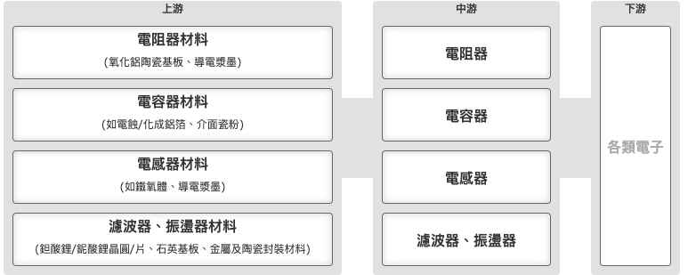

import Markmap from "../../../../components/Markmap.astro";

資料來源：櫃買中心 產業價值鏈資訊平台（J000 被動元件產業）https://ic.tpex.org.tw/introduce.php?ic=J000

## 產業鏈架構

<Markmap
  height="420px"
  markdown={`# 被動元件產業鏈
## 上游：材料供應商
### 電阻器材料
### 電容器材料
### 電感器材料
### 濾波器、振盪器材料
## 中游：元件製造商
### 電阻器
### 電容器
### 電感器
### 濾波器、振盪器
## 下游：各類電子產品供應商`}
/>

## 各環節上市公司

資料來源：[櫃買中心 產業價值鏈資訊平台（J000 被動元件業）](https://ic.tpex.org.tw/introduce.php?ic=J000)。

下圖依上、中、下游分層，**僅收錄上市公司**（此產業鏈無創新板「-創」與外國上市「-KY」），已排除上櫃、興櫃及未上市的知名外國企業。部分公司橫跨多個環節，故會在不同節點重複出現。

<Markmap
  height="640px"
  markdown={`# 被動元件產業鏈（僅上市公司）

## 上游：材料供應商
### 電阻器材料
- 5434 崇越
### 電容器材料
- 2492 華新科
### 電感器材料
- 2459 敦吉
- 6155 鈞寶
### 濾波器、振盪器材料
- 4739 康普

## 中游：元件製造商
### 電阻器
- 2308 台達電
- 2327 國巨*
- 2371 大同
- 2428 興勤
- 2478 大毅
- 2492 華新科
- 6224 聚鼎
- 6834 天二科技
### 電容器
- 2308 台達電
- 2327 國巨*
- 2375 凱美
- 2413 環科
- 2472 立隆電
- 2492 華新科
- 3026 禾伸堂
- 3090 日電貿
- 6449 鈺邦
### 電感器
- 2308 台達電
- 2327 國巨*
- 2492 華新科
- 5434 崇越
- 6155 鈞寶
### 濾波器、振盪器
- 2327 國巨*
- 2459 敦吉
- 2484 希華
- 2492 華新科
- 3026 禾伸堂
- 3042 晶技
- 6155 鈞寶

## 下游：各類電子產品供應商
### 頁面未列具體上市公司`}
/>

## 上游：材料供應商
### 電阻器材料
- 5434 崇越
### 電容器材料
- 2492 華新科
### 電感器材料
- 2459 敦吉
- 6155 鈞寶
### 濾波器、振盪器材料
- 4739 康普

## 中游：元件製造商
### 電阻器
- 2308 台達電
- 2327 國巨*
- 2371 大同
- 2428 興勤
- 2478 大毅
- 2492 華新科
- 6224 聚鼎
- 6834 天二科技
### 電容器
- 2308 台達電
- 2327 國巨*
- 2375 凱美
- 2413 環科
- 2472 立隆電
- 2492 華新科
- 3026 禾伸堂
- 3090 日電貿
- 6449 鈺邦
### 電感器
- 2308 台達電
- 2327 國巨*
- 2492 華新科
- 5434 崇越
- 6155 鈞寶
### 濾波器、振盪器
- 2327 國巨*
- 2459 敦吉
- 2484 希華
- 2492 華新科
- 3026 禾伸堂
- 3042 晶技
- 6155 鈞寶