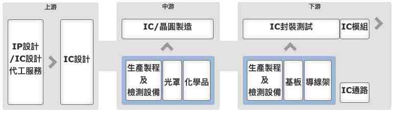

import Markmap from "../../../../components/Markmap.astro";

資料來源：[櫃買中心 產業價值鏈資訊平台（D000 半導體業）](https://ic.tpex.org.tw/introduce.php?ic=D000)。

## 產業鏈架構

<Markmap
  height="420px"
  markdown={`# 半導體產業鏈
## 上游
### IP 設計／IC 設計代工服務
### IC 設計
## 中游
### IC／晶圓製造
### 生產製程及檢測設備
### 光罩
### 化學品
## 下游
### IC 封裝測試
### IC 模組
### 生產製程及檢測設備
### 基板
### 導線架
### IC 通路`}
/>

## 各環節上市公司

下圖依上、中、下游分層，**僅收錄上市公司**（含創新板「-創」與外國上市「-KY」，皆屬集中市場上市），已排除上櫃、興櫃、創櫃。部分公司橫跨多個環節，故會在不同節點重複出現。

<Markmap
  height="720px"
  markdown={`# 半導體產業鏈（僅上市公司）

## 上游：IP/IC 設計
### IC 設計
- 2401 凌陽
- 3035 智原
- 3443 創意
- 5222 全訊
- 6533 晶心科
- 6695 芯鼎
- 3661 世芯-KY

## 中游：晶圓製造／設備／光罩／化學品
### 晶圓製造
- 2303 聯電
- 2330 台積電
- 2337 旺宏
- 2340 台亞
- 2344 華邦電
- 2371 大同
- 2408 南亞科
- 2434 統懋
- 2455 全新
- 3016 嘉晶
- 3532 台勝科
- 4919 新唐
- 5222 全訊
- 6770 力積電
- 8028 昇陽半導體
### DRAM 製造
- 2344 華邦電
- 2408 南亞科
- 6770 力積電
### 其他 IC／二極體製造
- 2302 麗正
- 2340 台亞
- 2342 茂矽
- 2434 統懋
- 2481 強茂
- 3536 誠創
### 生產製程及檢測設備
- 2360 致茂
- 2467 志聖
- 3030 德律
- 3413 京鼎
- 3535 晶彩科
- 3583 辛耘
- 4949 有成精密
- 5222 全訊
- 5434 崇越
- 6277 宏正
- 6438 迅得
- 6515 穎崴
- 6658 聯策
- 6706 惠特
- 6789 采鈺
- 6909 創控
- 6937 天虹
- 7631 聚賢研發-創
- 7730 暉盛-創
- 7769 鴻勁
- 7795 長廣
- 7822 倍利科
- 8374 羅昇
### 光罩
- 2338 光罩
- 2438 翔耀
### 化學品
- 1711 永光
- 1717 長興
- 1727 中華化
- 2493 揚博
- 3010 華立
- 3305 昇貿
- 4720 德淵
- 4722 國精化
- 4755 三福化
- 4764 雙鍵
- 5234 達興材料
- 5434 崇越

## 下游：封測／基板／導線架／模組／通路
### IC 封裝測試
- 1410 南染
- 1434 福懋
- 2329 華泰
- 2337 旺宏
- 2340 台亞
- 2369 菱生
- 2441 超豐
- 2449 京元電子
- 3450 聯鈞
- 3711 日月光投控
- 6239 力成
- 6257 矽格
- 6271 同欣電
- 8110 華東
- 8131 福懋科
- 8150 南茂
- 8162 微矽電子-創
### 基板
- 2459 敦吉
- 3189 景碩
- 4938 和碩
- 6271 同欣電
- 6552 易華電
- 8070 長華
### 導線架
- 2351 順德
- 2483 百容
- 2486 一詮
- 3653 健策
- 5285 界霖
- 8070 長華
### IC 模組
- 1434 福懋
- 2308 台達電
- 2451 創見
- 3054 立萬利
- 3135 凌航
- 3150 鈺寶-創
- 5222 全訊
- 6271 同欣電
- 8131 福懋科
- 8271 宇瞻
### IC 通路
- 2308 台達電
- 2347 聯強
- 2459 敦吉
- 3010 華立
- 3026 禾伸堂
- 3028 增你強
- 3033 威健
- 3036 文曄
- 3048 益登
- 3209 全科
- 3312 弘憶股
- 3528 安馳
- 3702 大聯大
- 6189 豐藝
- 6192 巨路
- 8112 至上`}
/>

## 上游：IP/IC 設計
### IC 設計
- 2401 凌陽
- 3035 智原
- 3443 創意
- 5222 全訊
- 6533 晶心科
- 6695 芯鼎
- 3661 世芯-KY

## 中游：晶圓製造／設備／光罩／化學品
### 晶圓製造
- 2303 聯電
- 2330 台積電
- 2337 旺宏
- 2340 台亞
- 2344 華邦電
- 2371 大同
- 2408 南亞科
- 2434 統懋
- 2455 全新
- 3016 嘉晶
- 3532 台勝科
- 4919 新唐
- 5222 全訊
- 6770 力積電
- 8028 昇陽半導體
### DRAM 製造
- 2344 華邦電
- 2408 南亞科
- 6770 力積電
### 其他 IC／二極體製造
- 2302 麗正
- 2340 台亞
- 2342 茂矽
- 2434 統懋
- 2481 強茂
- 3536 誠創
### 生產製程及檢測設備
- 2360 致茂
- 2467 志聖
- 3030 德律
- 3413 京鼎
- 3535 晶彩科
- 3583 辛耘
- 4949 有成精密
- 5222 全訊
- 5434 崇越
- 6277 宏正
- 6438 迅得
- 6515 穎崴
- 6658 聯策
- 6706 惠特
- 6789 采鈺
- 6909 創控
- 6937 天虹
- 7631 聚賢研發-創
- 7730 暉盛-創
- 7769 鴻勁
- 7795 長廣
- 7822 倍利科
- 8374 羅昇
### 光罩
- 2338 光罩
- 2438 翔耀
### 化學品
- 1711 永光
- 1717 長興
- 1727 中華化
- 2493 揚博
- 3010 華立
- 3305 昇貿
- 4720 德淵
- 4722 國精化
- 4755 三福化
- 4764 雙鍵
- 5234 達興材料
- 5434 崇越

## 下游：封測／基板／導線架／模組／通路
### IC 封裝測試
- 1410 南染
- 1434 福懋
- 2329 華泰
- 2337 旺宏
- 2340 台亞
- 2369 菱生
- 2441 超豐
- 2449 京元電子
- 3450 聯鈞
- 3711 日月光投控
- 6239 力成
- 6257 矽格
- 6271 同欣電
- 8110 華東
- 8131 福懋科
- 8150 南茂
- 8162 微矽電子-創
### 基板
- 2459 敦吉
- 3189 景碩
- 4938 和碩
- 6271 同欣電
- 6552 易華電
- 8070 長華
### 導線架
- 2351 順德
- 2483 百容
- 2486 一詮
- 3653 健策
- 5285 界霖
- 8070 長華
### IC 模組
- 1434 福懋
- 2308 台達電
- 2451 創見
- 3054 立萬利
- 3135 凌航
- 3150 鈺寶-創
- 5222 全訊
- 6271 同欣電
- 8131 福懋科
- 8271 宇瞻
### IC 通路
- 2308 台達電
- 2347 聯強
- 2459 敦吉
- 3010 華立
- 3026 禾伸堂
- 3028 增你強
- 3033 威健
- 3036 文曄
- 3048 益登
- 3209 全科
- 3312 弘憶股
- 3528 安馳
- 3702 大聯大
- 6189 豐藝
- 6192 巨路
- 8112 至上