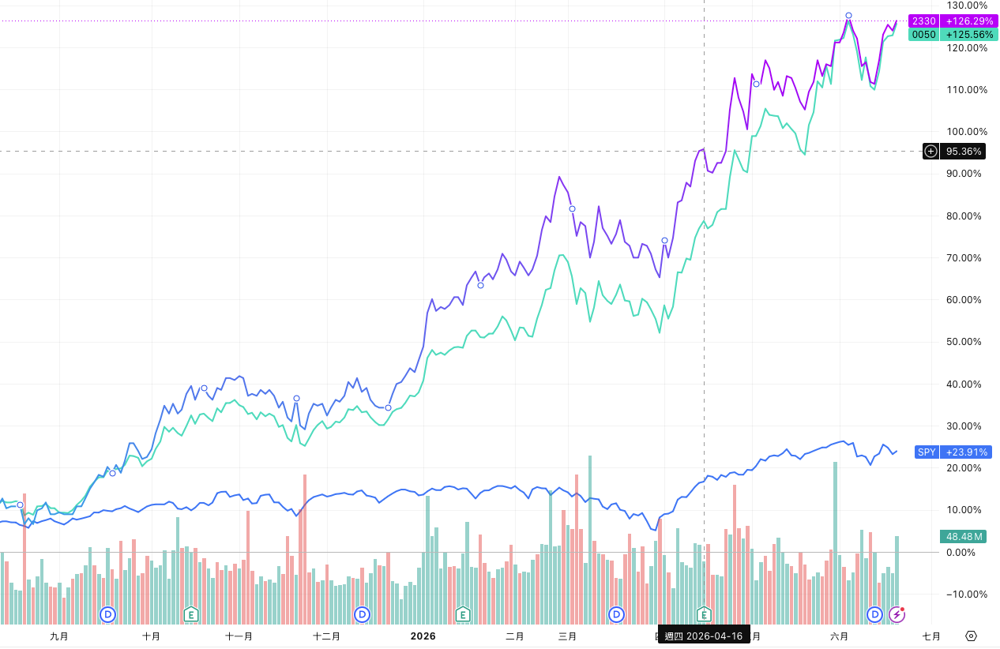
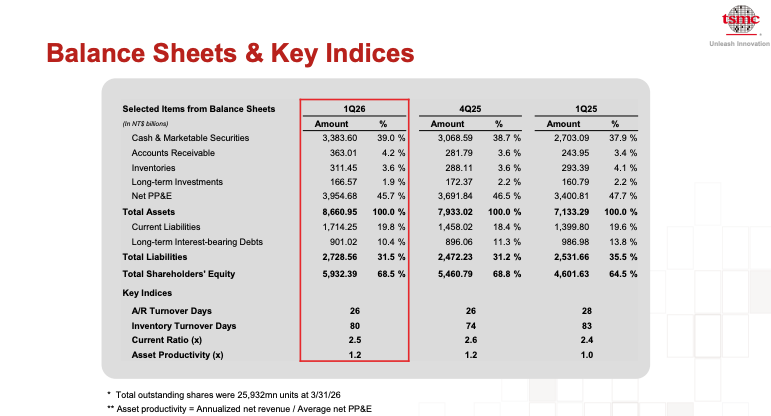
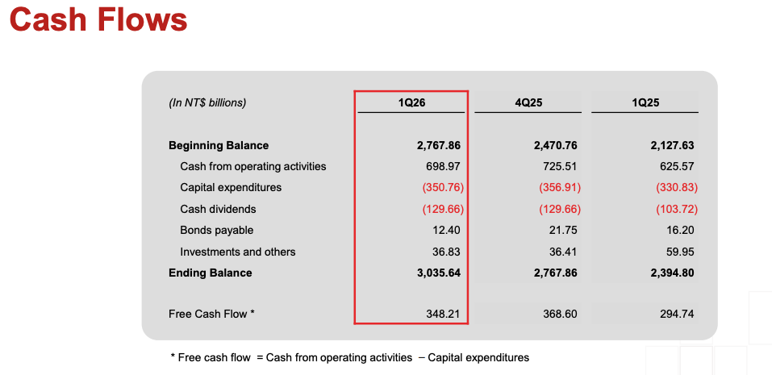
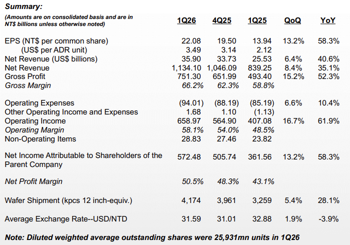
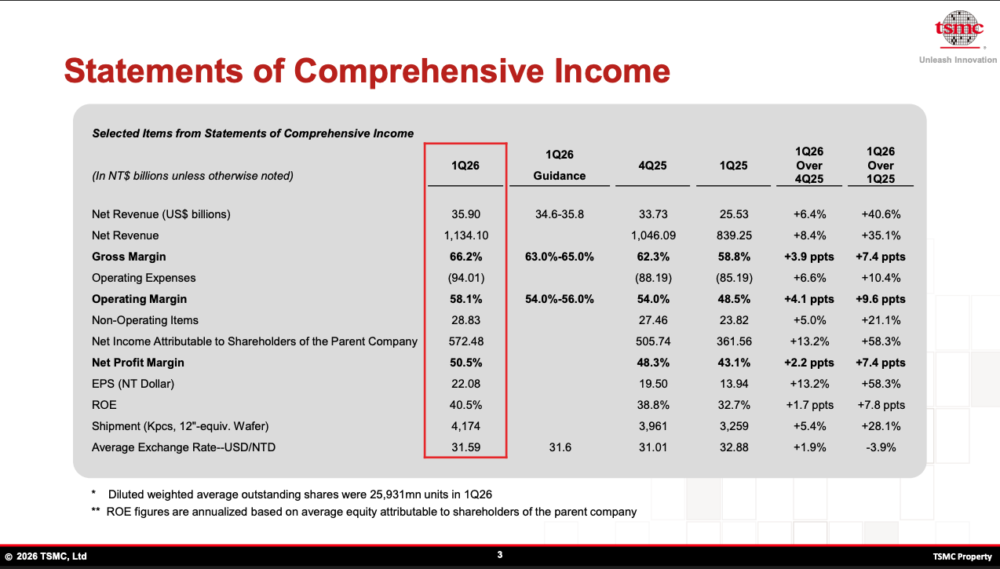
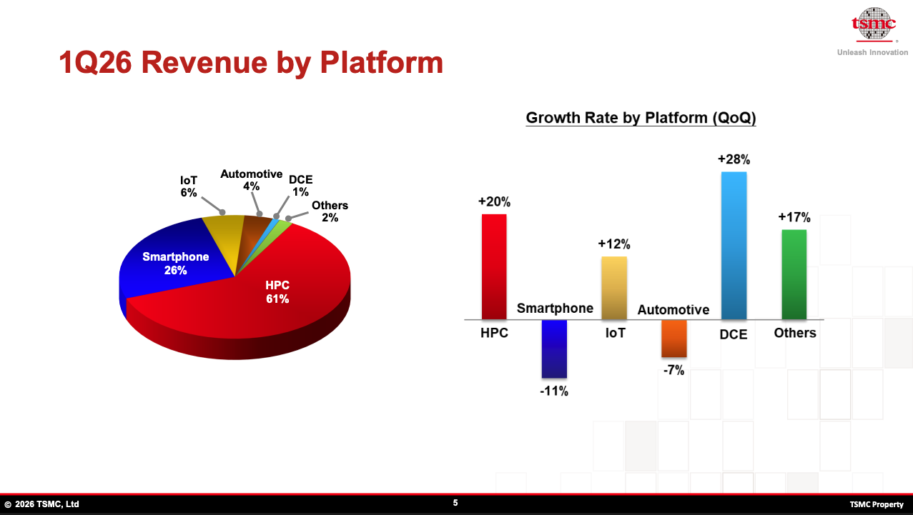
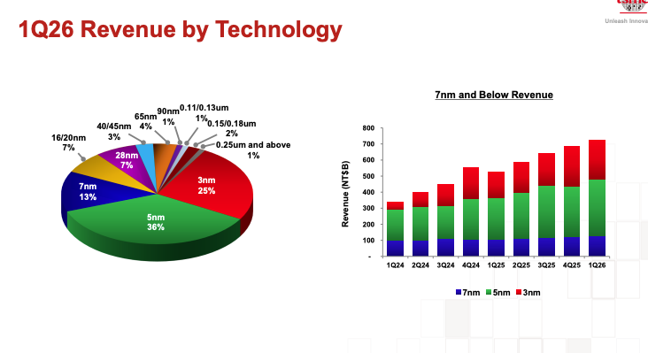

TSMC 法說/財報：https://investor.tsmc.com/chinese/quarterly-results/2026/q1

Q1 date: 4/16

Q2 date:7 月中旬召開

---

## 蝸牛觀點
* 台積很賺大家都知道，但風險在收益太側重在 HPC（高效能運算 → AI），導致如果 AI 泡沫就沒救了，雖然這可能性不高
* 4/16 法說會當天股價 2085，隔天4/17掉到 2030 → **情報在當下已經反映在市場了**

## 分析 - 總結
1. **生意品質：頂級。** 先進製程占 74%、AI/HPC 驅動、毛利率 66%、ROE 40% 且幾乎不靠槓桿、淨現金堡壘——這些都成立，財務風險極低。
2. **成長含金量：高，但別誇大。** FCF margin 30.7% 很強，股利覆蓋充裕；**但獲利轉現金的速度（OCF +12%）遠慢於帳面獲利（+58%），且下半年 CapEx 會加速壓縮 FCF**。這是把「成長很棒」修正成「成長很棒、但要扣掉現金轉換落差與資本支出加碼」的關鍵兩點。
3. **估值：沒有便宜到「無腦買」，也沒貴到離譜，落在「合理偏滿、且高度押注 AI 成長能否延續」的區間。** 用一年成長看 PEG<1 偏吸引；用長期成長看 PEG>1 偏貴。
4. **真正的決策點，不再是「公司好不好」（答案是很好），而是兩個你必須自己形成觀點的問題**：(a) 你相不相信 30%+ 的成長能延續超過一年？(b) 你願意為這個成長付到約 24 倍預估本益比嗎？

## 圖表

EPS: 

#### revenue by platform

## 分析 - 細節
以下依「投資人該優先盯、且具趨勢意義」的順序排成 5 點。一樣，這是分析框架不是投資建議。

### 1. 需求引擎與集中度：AI/HPC ＋ 先進製程占比（最高優先）
這是驅動營收、利潤率、產能利用率的「總開關」，也是最大的單一風險。現狀：HPC 占營收 61%、季增 +20%；7nm 以下先進製程合計約 74%（3nm 已 25% 且快速放大）；全年財測美元營收年增 30%+、且下季無季節性回落。
- **要盯的趨勢**：HPC 占比與季增率的「方向」、3nm 滲透速度、未來幾季有沒有打破季節性。這條若轉弱，成長與高利潤率會同時受傷——因為集中，衝擊更大。

### 2. 利潤率的高度與可持續性（次高）
利潤率是台積電與「商品化代工」的分水嶺，目前在記錄高檔。現狀：毛利率 66.2%、營業利益率 58.1%，且財測把毛利率守在 65.5–67.5%、營益率 56.5–58.5%（不降反穩）。
- **要盯的趨勢／缺口**：海外廠（美、日、德）對毛利率的稀釋幅度（這是法說會 Q&A 該找的細節），以及新台幣匯率走勢。能在擴產期守住 65%+ 是好訊號，但這是最該逐季驗證的承諾。

### 3. 資本密集度 →自由現金流（高）
- **要盯的趨勢**：FCF 的絕對值與 FCF margin、資產生產力是否續升（下滑＝過度投資或需求轉弱的早期警訊）。

現金流量表把「成長到底有沒有變成現金」這題講清楚了：

- **營業現金流（OCF）698.97 億 → 占營收 61.6%；自由現金流（FCF）348.21 億 → FCF 利潤率 30.7%。** 對一家資本密集公司來說，三成的 FCF margin 非常強。
- **CapEx 占 OCF 約 50%**——它把營業現金流的一半拿去投資，另一半還能留下來當自由現金流。
- **股利覆蓋無虞**：現金股利 129.66 億，只占 FCF 的 37%、占淨利約 23%（低配息率），且股利年增 25%。剩下的現金繼續累積（本季帳上現金 2,767.86 → 3,035.64，淨增約 268 億）。

**但這裡藏了一個不明顯、卻最值得注意的訊號**：淨利年增 58.3%，可是**營業現金流只年增 11.7%**，FCF 只年增 18.1%。獲利爆發，但現金流跟不上同樣的速度。原因在前面資產負債表already有跡象——應收帳款年增約 49%、存貨天數從 74 升到 80。也就是說，**有一部分亮眼的帳面獲利，目前是卡在應收帳款和存貨裡，還沒收成現金**。把它量化：OCF/淨利的轉換率從一年前的 1.73 倍掉到 1.22 倍。

這在高速擴張期算正常（要先鋪貨、墊款才能做更多生意），但它是該逐季盯的領先指標：若這個落差持續擴大，就要留意是不是客戶付款被拉長或存貨堆積的風險。

**還有一個前瞻重點**：TSMC 全年 2026 資本支出預算是 520 至 560 億美元，而 1Q26 才花 111 億（年化約 440 億）。代表**CapEx 在後面幾季會明顯加速**——所以 1Q26 這個 30.7% 的 FCF margin，下半年很可能因為 CapEx 拉升而被壓縮。別把第一季的高 FCF margin 當成全年常態。

### 4. 估值（高；這是買賣決策的關卡）
再好的公司，買貴了報酬也會打折。前三點都是「公司有多好」，第 4 點才決定「現在這個價格值不值得」。
- **缺口（請務必補）**：目前股價、本益比、本益成長比（PEG），相對「未來 2–3 年成長性」是否合理。

> 蝸牛said - 可以找到數字：26Q1 (4/16)｜本益比: 23.66｜股價: 2085

先釐清你那個數字：**23.66 應該是「預估本益比（Forward PE）」**，因為它幾乎等於市場資料顯示的 2026 年 6 月 9 日預估本益比 23.69；而同一來源的 TTM（過去 12 個月）本益比約 30.9。兩者差很大，是因為市場已經把今年的高成長預先反映進去了。[GuruFocusGuruFocus](https://www.gurufocus.com/term/forward-pe-ratio/TPE:2330)

用你的股價 2085、Forward PE 23.66 反推，市場給 2026 全年 EPS 的預估約 NT$88，相對 2025 全年 EPS NT$66.25，等於隱含**約 +33% 的 EPS 成長**——這跟「全年營收美元計 +30% 以上」的財測一致。[sec](https://www.sec.gov/Archives/edgar/data/0001046179/000104617926000017/tsm-boardx20260210x6k.htm)

**PEG 自己算就好（PEG = 預估 PE ÷ 成長率），但結果會因為你選的成長率而天差地遠：**

- 用「未來一年」的成長（約 +30%～33%）：**PEG ≈ 23.66 / 33 ≈ 0.72**（小於 1，偏便宜）。
- 用「未來三年」較保守的年化成長（分析師估 未來三年 EPS 成長約 61%，年化約 17%）：**PEG ≈ 23.66 / 17 ≈ 1.4**（偏貴）。 [Simply Wall St](https://simplywall.st/stocks/tw/semiconductors/twse-2330/taiwan-semiconductor-manufacturing-shares)

**這就是你「找不到 PEG」的真正原因**——PEG 沒有標準定義，券商各用不同的成長期間，所以很少有網站直接給一個權威數字。而這個落差本身，恰恰就是投資爭論的核心：**你是在用約 24 倍預估本益比買「一年的 AI 爆發」，還是買「可持續的 30%+ 成長」？** 如果 AI 動能能撐住，現價不貴；如果只是一年的高峰、之後回到中個位數～十幾趴成長，現價就偏滿。

值得一提的反方觀點：有估值模型（GuruFocus 的 GF Value）把它列為 「明顯高估」，因為那類模型用的是長期正常化成長率——和上面「用三年成長算 PEG 偏貴」是同一個邏輯。

### 5. 財務體質與股東回報／資本配置（中高；體質已優異，回報政策為缺口）
這是安全網與「賺到的錢怎麼用」。現狀：淨現金約 NT$2,480 億（現金占資產 39%、長期有息負債僅 10.4% 且逐季下降）、股東權益占 68.5%、流動比 2.5 倍；ROE 40.5% 幾乎不靠槓桿——高品質特徵。財務風險極低。
- **缺口／要盯的趨勢**：股利政策與 FCF 的去向（配息、回購、再投資），以及存貨週轉天數（季增 74→80 天，仍低於去年 83，屬正常但要留意有沒有持續墊高）。

