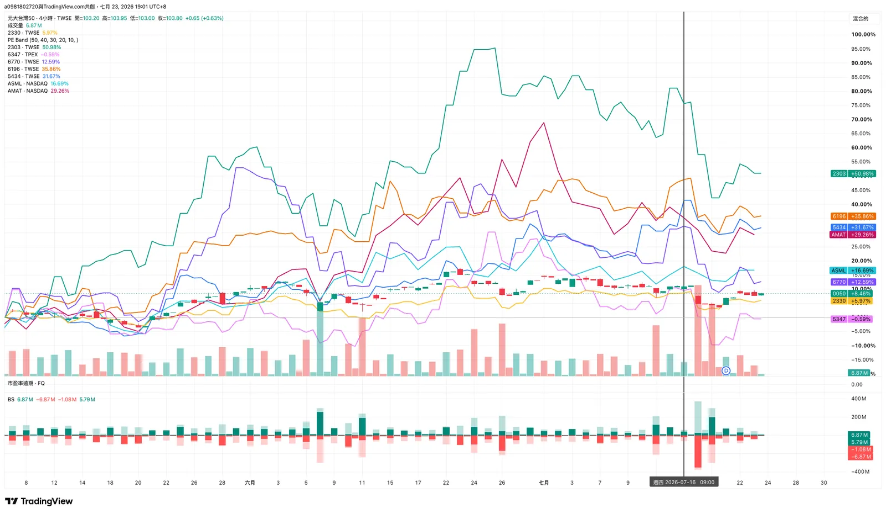

import BookmarkCard from '../../../../components/BookmarkCard.astro';
import Markmap from "../../../../components/Markmap.astro";
import { Badge } from '@astrojs/starlight/components';

TSMC 法說/財報：<BookmarkCard href="https://investor.tsmc.com/chinese/quarterly-results/2026/q2" title="/quarterly-results/2026/q2" />

Q2 date: 7/16

---
* 每月財報（6-K）：<BookmarkCard title="TSM 美國金管會報告查詢"  href="https://www.sec.gov/edgar/browse/?CIK=1046179&owner=exclude" />

SEC 各表格類型說明

SEC＝美國證券交易委員會 U.S. Securities and Exchange Commission

台積電定期申報的文件：
* **Form 20-F（年報）**——最重要的一份。相當於美國公司 10-K 的外國版，每個會計年度結束後申報一次（台積電通常在 4 月左右）。內容包含完整經審計財報、風險因子、營運與產業分析、股權結構、公司治理。想深挖台積電的地緣政治風險揭露、客戶集中度，這份最完整，資訊密度遠高於台灣年報。

* **Form 6-K（重大訊息即時申報）**——最頻繁的一份。外國發行人版的 8-K，凡是在台灣公開的重大資訊（每月營收、季度財報、法說會資料、股利公告、重大訊息），都要同步用 6-K 向 SEC 申報。所以你之前追的每月營收、上週四的 Q2 法說簡報，其實都會以 6-K 形式出現在 SEC 系統裡。

* **Form F-6 / F-6EF（ADR 註冊）**——存託憑證發行相關的註冊文件，由存託銀行（花旗）處理，屬於制度性文件，投資分析上用不到。

---

## 26Q2 財報看點（7/16 法說會）

> 一句話總結：**營收、獲利、毛利率三破紀錄，但股價當天卻跌約 5%** —— 市場買的是「超預期」，而這次財報只是「符合甚至略高於已被墊高的高標」，加上資本支出暴增引發資本效率疑慮。

 
<BookmarkCard title="簡報" href="https://investor.tsmc.com/chinese/encrypt/files/encrypt_file/reports/2026-07/2b15e54c7bf8696e0390121adebd2dba48b9d6d5/2Q26%20Presentation%20%28C%29.pdf"/>

### 關鍵數字

| 指標 | 26Q2 實際 | YoY | QoQ | 備註 |
|------|-----------|-----|-----|------|
| 合併營收 | NT\$1,270.38 億（US\$40.2B） | +36.0% | +12.0% | 落在財測高標 |
| 稅後淨利 | NT\$7,065.6 億 | +77.4% | +23.4% | **連五季創新高** |
| 稀釋 EPS | NT\$27.25 | +77.4% | — | |
| 毛利率 | **67.7%** | — | +1.5pp | 單季歷史新高，超財測 |
| 淨利率 | 55.6% | — | — | |

### 三大看點

1. **毛利率 67.7% 創高，但下一季要降** —— 26Q3 毛利率財測下修到 65–67%，管理層定調為「timing（時點問題）而非結構性」，壓力來自 N2 試產稀釋（-3\~4pp）＋ 海外廠（亞利桑那）擴產與匯率逆風（-3\~4pp）。匯率假設 1 美元兌 31.6 台幣，台幣升值是隱形殺手。
2. **資本支出從 \$52–56B 一口氣拉到 \$60–64B** —— 年增約 46–56%，是這次最大意外。分配：先進製程 70–80%、特殊製程約 10%、**先進封裝/測試/光罩史無前例佔 10–20%**。同時宣布加碼亞利桑那 \$100B（累計 \$265B、至少再蓋 4 座 2nm 廠）。
3. **AI/HPC 是唯一引擎** —— HPC 占晶圓營收 66%、單季 +20%；智慧型手機掉到 22%（QoQ -4%）。魏哲家（C.C. Wei）稱「AI 需求會強到 2029–2030 年」（來源：[TSMC CEO：AI 需求強勁至 2030｜BigGo Finance](https://finance.biggo.com/news/f00d7c69-73b2-47a0-9236-29a714d35771)），全年美元營收成長上修到「略高於 40%」。先進製程（5nm 以下）占營收 77%：3nm 30%、5nm 33%、2nm 3%（初升溫）。

### 為什麼破紀錄股價還跌？（不同觀點）

<Badge text="蝸牛提醒：本文主要由 Opus4.8 整理" variant="caution" />

| 觀點 | 論述 |
|------|------|
| 空方 / 謹慎 | 資本支出暴增壓縮短期自由現金流，市場擔心「錢是變成沙漠裡的新廠、還是能變成可用現金」；ROI (投資報酬率) 時點不明。JPMorgan：財報只證明「半導體的門檻被設得多高」。<BookmarkCard href="https://www.tradingkey.com/analysis/stocks/us-stocks/262036881-tsmc-tsm-breaks-q2-2026-records-tradingkey" title="TradingKey：TSMC 破紀錄卻跌 5%" /> |
| 空方 / 產業 | 同一週 ASML 也是「超財測＋上修展望＋股價下跌」，反映 AI 概念漲多、利多出盡的類股輪動。<BookmarkCard href="https://www.tradingkey.com/analysis/stocks/us-stocks/262036881-tsmc-tsm-breaks-q2-2026-records-tradingkey" title="TradingKey：TSMC 破紀錄卻跌 5%" /> |
| 多方 / 結構 | ASML 上修＋30% 擴產、TSMC 破紀錄＋$64B 資本支出，共同指向「先進矽的實體瓶頸還在擴張、不是退縮」，是多年成長的實證。<BookmarkCard href="https://seekingalpha.com/article/4922965-asml-and-tsmc-the-ai-buildout-is-getting-more-expensive" title="Seeking Alpha：AI 建置越來越貴" /><BookmarkCard href="https://fourweekmba.com/ai-asml-tsmc-q2-2026-capacity-expansion-chip-cycle/" title="FourWeekMBA：ASML 與 TSMC 逆勢加碼" /> |
| 多方 / 護城河 | 毛利率壓力純屬 N2 爬坡與海外廠的短期時點，長期定價權與 2nm 領先未變。<BookmarkCard href="https://finance.biggo.com/news/US_TSM_2026-07-16" title="BigGo：TSMC 26Q2 法說會重點" /> |

---

## 新一波資金可能流向哪裡？

<Badge text="蝸牛二次提醒：本文主要由 Opus4.8 整理 ：）" variant="caution" />

台積電這次「加碼先進製程＋先進封裝、但對成熟製程明確潑冷水」，直接造成半導體板塊的**殘酷分化**：資金往「先進製程資本支出受惠鏈」集中，從「標準成熟製程」流出。

<Markmap
  height="560px"
  markdown={`# TSMC 26Q2 資本支出上修 \$60–64B（先進製程＋CoWoS 為主力）
## 💰 資金流入：先進製程資本支出受惠鏈
### 台廠設備／廠務／耗材
#### 帆宣 6196
#### 崇越 5434
#### 中砂 1560
#### 京鼎 3413
#### 漢唐 2404
### 國際設備商
#### ASML
#### Applied Materials（AMAT）
#### Lam Research（LRCX）
#### KLA
#### Tokyo Electron
### CoWoS 先進封裝鏈
#### 2024→2026 產能擴四倍
## 📉 資金流出：標準成熟製程
### 成熟製程三雄（法說後跌停）
#### 聯電 2303
#### 世界先進 5347
#### 力積電 6770
### 結構性受惠例外
#### 電源管理 IC
#### 感測器（AI 伺服器／邊緣 AI 拉動）`}
/>

### 受惠方（資金流入）

- **台廠設備／廠務／耗材**：元大投顧點名 **帆宣（6196）、崇越（5434）、中砂（1560）、京鼎（3413）**，在手訂單能見度看到 2028 年；建廠初期廠務工程先受惠（漢唐 2404），2026 美國 P2（亞利桑那州二廠，規劃 3 奈米製程） 工程入帳高峰、2027 後 P3 廠（亞利桑那三廠）/AP 廠（Advanced Packaging，先進封裝廠） 接棒。
- **國際大廠設備**：ASML、Applied Materials（AMAT）、Lam Research（LRCX）、KLA、Tokyo Electron —— $64B 中 7–8 成砸在先進製程設備。
- **CoWoS 先進封裝鏈**：CoWoS 產能 2024→2026 擴四倍，先進封裝首度佔資本支出 10–20%；且魏哲家對競爭對手封裝方案「樂見其成」，因為能回頭帶動 TSMC 前段晶圓需求。

**補充：** CoWoS（Chip-on-Wafer-on-Substrate）是台積電（TSMC）獨家的「2.5D 高階先進封裝技術」。目前市場上所有最強的 AI 晶片（如 NVIDIA 的 H100、B200、Rubin 以及 AMD 的 MI300 系列）都必須強制使用 CoWoS 封裝才能運作。

### 受害／分化方（資金流出）

- **成熟製程三雄**：魏哲家被問成熟製程是否全面回溫，直接回「**Not at all**」，戳破「台積產能外溢」的想像，**聯電（2303）、世界先進（5347）、力積電（6770）法說後全面跌停**。
- **標準消費性成熟製程**：手機、PC 等標準化需求仍疲弱。
- **例外（仍受惠）**：**電源管理 IC 與感測器** —— AI 伺服器電源需求暴增、邊緣 AI 帶動 CMOS 影像感測器，是成熟/特殊製程中少數吃緊的差異化應用。

> **投資含義**：這次的錢不是雨露均霑，而是往「差異化、高附加價值」集中。押注邏輯從「買整片半導體」轉向「買先進製程資本支出鏈＋高階封裝」，同時對純標準成熟製程代工保持距離。

7/23 四小時線圖

<Badge text="蝸牛：無一倖免，都跌啦，這陣子上不來囉！" variant="note" />

---

## Sources

- [TSMC Reports Record Q2 2026 Earnings（TechPowerUp）](https://www.techpowerup.com/350807/tsmc-reports-record-q2-2026-earning-results)
- [TSMC Q2 2026: Record profit, $100B Arizona investment（Yahoo Finance）](https://finance.yahoo.com/markets/stocks/articles/tsmc-q2-2026-earnings-record-112109987.html)
- [TSMC Breaks Q2 2026 Records, Then Falls 5%（TradingKey）](https://www.tradingkey.com/analysis/stocks/us-stocks/262036881-tsmc-tsm-breaks-q2-2026-records-tradingkey)
- [TSMC Q2 2026 Earnings Call 重點（BigGo Finance）](https://finance.biggo.com/news/US_TSM_2026-07-16)
- [TSMC commits another $100B to Arizona（Tom's Hardware）](https://www.tomshardware.com/tech-industry/tsmc-commits-another-100-billion-to-arizona-for-at-least-four-more-2nm-fabs)
- [台積電擴大資本支出 4 家設備供應鏈率先受惠（自由財經）](https://ec.ltn.com.tw/article/breakingnews/5510104)
- [魏哲家一句話 聯電、世界全跌停 半導體「殘酷分化」（Yahoo 股市）](https://tw.stock.yahoo.com/news/%E9%AD%8F%E5%93%B2%E5%AE%B6-%E5%8F%A5%E8%A9%B1-%E8%81%AF%E9%9B%BB-%E4%B8%96%E7%95%8C%E5%85%A8%E8%B7%8C%E5%81%9C-%E6%B3%95%E4%BA%BA%E6%8F%AD%E5%8D%8A%E5%B0%8E%E9%AB%94-050800722.html)
- [ASML and TSMC: The AI Buildout Is Getting More Expensive（Seeking Alpha）](https://seekingalpha.com/article/4922965-asml-and-tsmc-the-ai-buildout-is-getting-more-expensive)