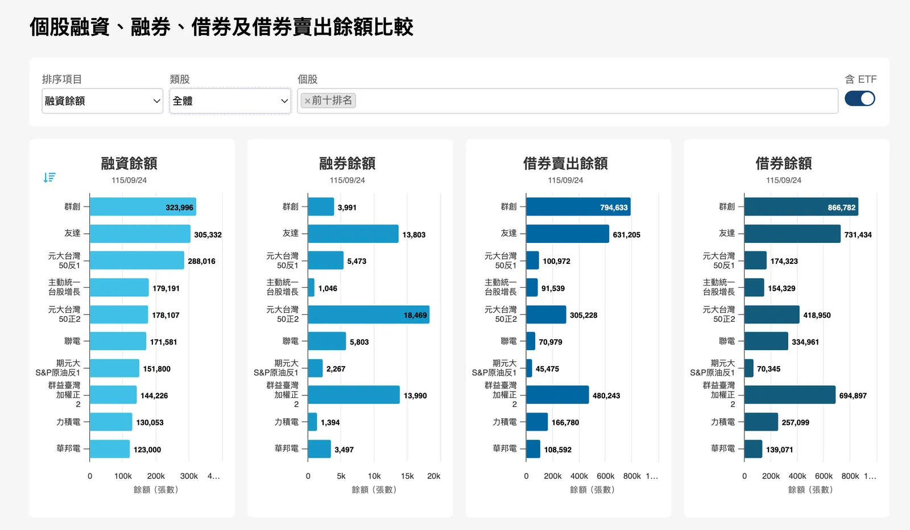

import BookmarkCard from '../../../../components/BookmarkCard.astro';

## 融資：借錢買股票

融資就是「向證券商借錢買股」。這是一種開槓桿、放大資金效能的工具。

* **台股規則：** 上市股票的融資成數通常為 **6 成**。
* **白話解釋：** 想買 100 萬元的股票，你只需自備 **40 萬元（本金）**，券商會借你 **60 萬元（負債）**。

---

## 融資維持率：公式與本金損益

券商借錢給你，最怕你賠光還不起。因此，系統會天天盯著你的「融資維持率」。

> 🧮 **計算公式：**
> 
> $$融資維持率 = \left( \frac{\text{股票目前的總市值}}{\text{你向券商借的金額}} \right) \times 100\%$$
> 
> 

### 維持率下降對本金的影響

很多新手誤以為維持率跌到 100% 以下才危險，這是極其致命的誤解：

| 維持率位階          | 股票市值變動 | 你的本金損益狀態             | 券商處置動作                   |
| ------------------- | ------------ | ---------------------------- | ------------------------------ |
| **166%** *(進場)*   | 100 萬       | 本金 40 萬（100% 完好）      | 正常交易                       |
| **130%** *(警戒線)* | 78 萬        | 本金剩 18 萬（**慘賠 55%**） | **發出追繳令**，限期補錢。     |
| **120%** *(斷頭線)* | 72 萬        | 本金剩 12 萬（**慘賠 70%**） | **強制砍倉**（俗稱斷頭）。     |
| **100%**            | 60 萬        | 本金 **0 元（全賠光）**      | 股票市值已等同借款，極度危險。 |

 

> ⚠️ **關鍵觀念：** 券商必須在 130%~120%（你本金賠一半以上、但還夠還債時）就動手。若等到 100% 以下，股票價值低於借款，券商自己就會賠錢。

## 斷頭風險：跌停賣不掉與超額損失

當市場發生系統性崩盤（例如國際黑天鵝事件、海外 ADR 暴跌），台股一開盤可能所有股票直接「鎖跌停（大跌 10% 且完全沒有買家）」。這時候，融資族會陷入最恐怖的處境：

* **第一步：券商每天排隊掛賣**
雖然你的維持率跌破 120%，券商依法要幫你「斷頭（強制賣出）」，但因為市場上一個買家都沒有，**完全賣不掉**。
* **第二步：倒貼負債（穿價 / 超額損失）**
股票連續鎖跌停，維持率一路跌破 100%、90%... 這時股票的價值已經比你欠券商的 60 萬還要少。你的本金不僅歸零，還開始**倒欠券商錢**。
* **第三步：打開跌停後的「追討差額」與法律責任**
幾天後跌停終於打開、成功賣出股票。賣出所得如果卡在 50 萬，扣除你欠的 60 萬，券商會向你寄發催告函，限期補齊那「倒貼的 10 萬元」。
* **第四步：違約交割與信用破產**
如果付不出倒貼的差額，將被申報**違約交割**。這不僅會面臨法律訴訟、財產被強制執行，你在整個台灣金融體系的信用紀錄也將徹底破產，未來無法再開戶買賣股票。

---

## 券資比：公式與多空部位判讀

### 計算公式與範例

**券資比（%）＝ 融券餘額張數 ÷ 融資餘額張數 × 100%**

分子、分母必須是同一天、同一股票或市場範圍的數據，且都用張數（或都用股數），**不能拿融券張數除以融資金額**。例如融券餘額 200 張、融資餘額 10,000 張，券資比就是 2%，意思是每 100 張融資部位，對應 2 張融券部位。

### 券資比的判讀方式

- **信用交易中，空方相對多方的部位大小**：比率越高，表示融券相對融資越多；比率越低則相反。它不是全市場看空或看多人數的比例。
- **比率變動的來源**：券資比上升，可能是融券增加，也可能只是融資減少，或兩者同時發生。因此，不能只看比率上升就認定有人大舉追空；融資減少也必須用「張數」資料核對，不能直接用金額變化判斷。
- **潛在回補壓力**：若融券部位多、股價又持續上漲，空方可能買回股票停損，形成軋空買盤。但券資比高不代表一定會軋空，還要看融券絕對張數、成交量與股價走勢；融券也可能透過現券償還結清。

**券資比只涵蓋融資、融券，不包含另行統計的借券賣出或衍生商品空單。** 所以低券資比不能直接推論整個市場沒有空單，也不能單靠它預測漲跌。資料口徑可參考 [證交所的融資、融券、借券及借券賣出餘額比較](https://www.twse.com.tw/IIH2/zh/compare/margin.html)。

---

### 「借券餘額、借券賣出餘額」是什麼
<BookmarkCard href="https://www.twse.com.tw/IIH2/zh/compare/margin.html"/>

**借券餘額**是已借入、尚未歸還的股票數量；**借券賣出餘額**則是借來的股票已經賣出、仍未回補的累積數量。兩者都是餘額，不是當天交易量。定義可參考[證交所投資問答第 7、8 題](https://investoredu.twse.com.tw/pages/TWSE_InvestmentQA.aspx?ID=8)。

#### 範例：借入 100 張，賣出 60 張

假設原先沒有借券部位，你借入 100 張股票，先賣出其中 60 張，且尚未回補或還券，此時：

- **借券餘額：100 張**，因為借來的股票都尚未歸還。
- **借券賣出餘額：60 張**，因為只有這 60 張已賣出、尚未回補。

剩下 40 張雖然借到手，卻尚未賣出，還沒有形成這筆借券的市場賣壓。因此，不能把借券餘額全部當成已放空的部位。

#### 圖表上的餘額增減代表什麼？

- **借券餘額增加**：借入未還的部位增加，不能直接說「今天有人大量放空」。
- **借券賣出餘額增加**：新增借券賣出超過回補，未結清的放空部位增加。
- **借券賣出餘額減少**：回補超過新增賣出，未結清部位縮減。

---

## 重點整理

1. **融資是雙面刃：** 它能讓你在多頭時賺取 2.5 倍的利潤，也能在空頭鎖跌停時，讓你幾天內本金歸零甚至背負債務。
2. **避開不穩定籌碼：** 當一檔股票「融資維持率極低、融資餘額卻極高」，代表裡面全是一群沒錢補保證金、隨時準備被斷頭的散戶。這種股票容易引發「多殺多」踩踏，千萬不要進去接刀。
3. **券資比要拆開看：** 比率上升可能來自融券增加或融資減少；它只反映信用交易部位，不能單憑高低判斷漲跌或是否會軋空。
