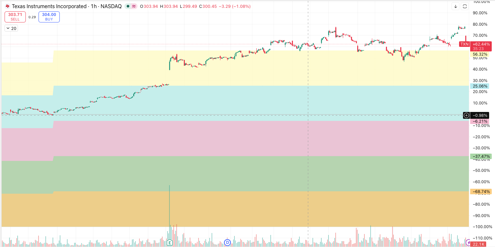
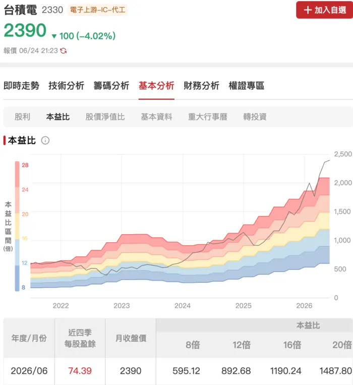

本頁 Test!

* 「PE, EPS, 股價」公式？
* 和 EPS 的關係？
* 影響決策的本益比，重要的是看「目前的值」？「未來的值」？
* 看圖平台的 PE 顯示在哪？看得到 PEG 嗎？

---

## 本益比公式

$$\text{PE} = \frac{\text{股價 (Price)}}{\text{每股盈餘 (EPS)}}$$

## 決策要點：

在華爾街或法人的眼裡，本益比 (Price-to-Earnings Ratio) 的底層邏輯是 **「回本年限」** 與 **「市場對未來成長性的『定價（Pricing）』」** 。如果你單純以為「本益比低就是便宜、高就是貴」，在實際交易中會遭遇毀滅性的「低估值陷阱」或錯失高速成長的飆股。

以下是我在實際進行資產配置與右側交易時，解構並應用「本益比」的四大關鍵決策角度：

### 角度一：絕對本益比 vs 預期本益比（不要看後照鏡開車）

多數散戶在看盤軟體上看到的本益比，是「歷史本益比（Trailing PE）」，也就是用「過去四季的真實 EPS」來計算。

* **專業投資人的做法：** 我會直接過濾掉歷史本益比，改看「預期本益比（Forward PE）」。
* **決策影響：** 股票買的是未來。假設一檔科技股目前股價 \$100，過去 EPS 只有 \$2，看起來本益比高達 50 倍（好貴）。但透過我們的產業調研與供應鏈 Pipeline，得知它下半年拿下了 SpaceX（SPCX）或輝達晶片的大訂單，明年 EPS 預估會跳升至 \$10。
這時它的 **Forward PE 其實只有 10 倍（\$100 / \$10）**。在全市場還沒察覺前，這就是絕對的「低估買點」。

---

### 角度二：動態本益比（PEG）—— 判斷這檔股票是否配得上它的高估值

當一檔 AI 股或航太概念股的本益比高達 40 倍、50 倍時，專業投資人不會一概拒絕，而是會引入**PEG(本益比盈餘成長率)**來進行校正：

$$\text{PEG} = \frac{\text{本益比 (PE)}}{\text{預期盈餘成長率 (Growth Rate)}}$$

**決策標準：**
* **PEG = 1：** 估值合理。股票的本益比剛好配得上它的成長速度。
* **PEG < 0.75：** **極具投資價值。** 代表這家公司雖然本益比高，但它賺錢的速度更快。
* **PEG > 1.5：** 泡沫化、高估。這家公司的成長速度已經跟不上市場吹出來的估值。

* **實戰應用：** 只要 PEG 夠低，50 倍本益比的飆股我依然會順勢買進；相反地，如果一家傳統產業（如鋼鐵）本益比只有 8 倍，但它的盈餘成長率是 0%（甚至衰退），其 PEG 趨近於無限大，我會嚴格避開。

---

### 角度三：產業橫向對比與歷史河流圖

本益比是一個高度依賴「產業特質」與「市場流動性」的相對數字。你不能拿台積電的本益比去跟長榮海運比。

* **歷史河流圖（PE Band）：** 我會拉出該個股過去 5 年至 10 年的本益比區間。每檔股票都有自己的「本益比慣性」。例如某檔高殖利率金融股，歷史本益比永遠卡在 10~12 倍之間。當它因為短期利空被砸到 8 倍本益比時，就是明確的價值投資買點（左側建倉）。
    * 🔍 Trading View > 技術指標 > 搜尋「PE Band」（P.S. 不是每個標的都有資料）
    
     
    * https://www.cmoney.tw/forum/stock/2330?s=pe
     

* **板塊橫向對比：** 如果整個晶片設計產業的平均本益比是 30 倍，而其中一檔市佔率、毛利率都與龍頭相當的優質股，卻因為外資短期提款導致本益比掉到 18 倍。這代表出現了「估值套利空間」，法人資金遲早會回流幫它補漲復歸。

---

### 角度四：本益比的「動態反轉」—— 風險控制與賣出訊號

基於**亞當理論（順勢交易）**，本益比的變化往往是趨勢反轉的煙霧彈。我會緊盯兩種極端金融現狀：

1. **低本益比陷阱（Value Trap）：** 當一檔股票大跌，本益比跌到歷史新低的 5 倍時，**絕對不要盲目抄底**。這通常代表華爾街大機構已經提前預知該產業即將進入下行週期（如貨櫃航運景氣見頂）。此時的低本益比是「假的」，因為未來的 EPS 將會雪崩，過兩個季度後本益比會被動飆高。
2. **戴維斯雙擊與雙殺（Davis Double Play）：** 
$$\text{股價 (Price)} = \text{EPS} \times \text{本益比 (PE)}$$
    * **戴維斯雙擊（大賺）：** 當公司 EPS 成長，同時市場願意給它更高的本益比（從 15 倍調高到 25 倍），股價會出現乘數效應的暴漲。
    * **戴維斯雙殺（大虧）：** 這是最需要停損的時刻。當公司業績稍微不如預期（EPS下滑），華爾街同時對它失去信心、調降本益比估值。這會導致股價出現斷崖式崩盤（Bear 修正）。

---

### 💻 專業投資人的決策檢查表（Checklist）

當我看到一檔股票時，我的大腦（與系統演算法）會立刻跑出這個決策流程：

* **Step 1：** 這檔股票是屬於「高成長科技股」還是「景氣循環傳產股」？ 
➡️ *如果是景氣循環股，本益比要「買在高本益比（虧損沒賺錢時）、賣在低本益比（賺大錢景氣頂點時）」。*

景氣循環股 - 本益比反向邏輯

景氣谷底（買點）： 公司大虧損，EPS 接近零甚至負數。此時股價雖然跌深，但因為分母（EPS）太低，算出來的本益比（PE）反而高得嚇人。此時正是利空出盡的絕佳買點。

景氣頂點（賣點）： 產品報價暴漲，公司大賺錢，EPS 創歷史新高。此時因為分母（EPS）極大，算出來的本益比（PE）看起來非常便宜（超低本益比）。但這通常代表景氣即將見頂下行，是主力出貨的危險訊號。

* **Step 2：** Forward PE 的數據來源是否具備高信賴度（Confidence HIGH）？ 
美股：Yahoo Finance / Finviz / GuruFocus / Seeking Alpha 
台股：財報狗 / 關鍵電子報 / 大型券商報告（如元大、富邦、美林）

* **Step 3：** 計算 PEG。若 PEG < 1 且股價站上月線（20MA），判定為「估值合理的動能股」，順勢進場。
