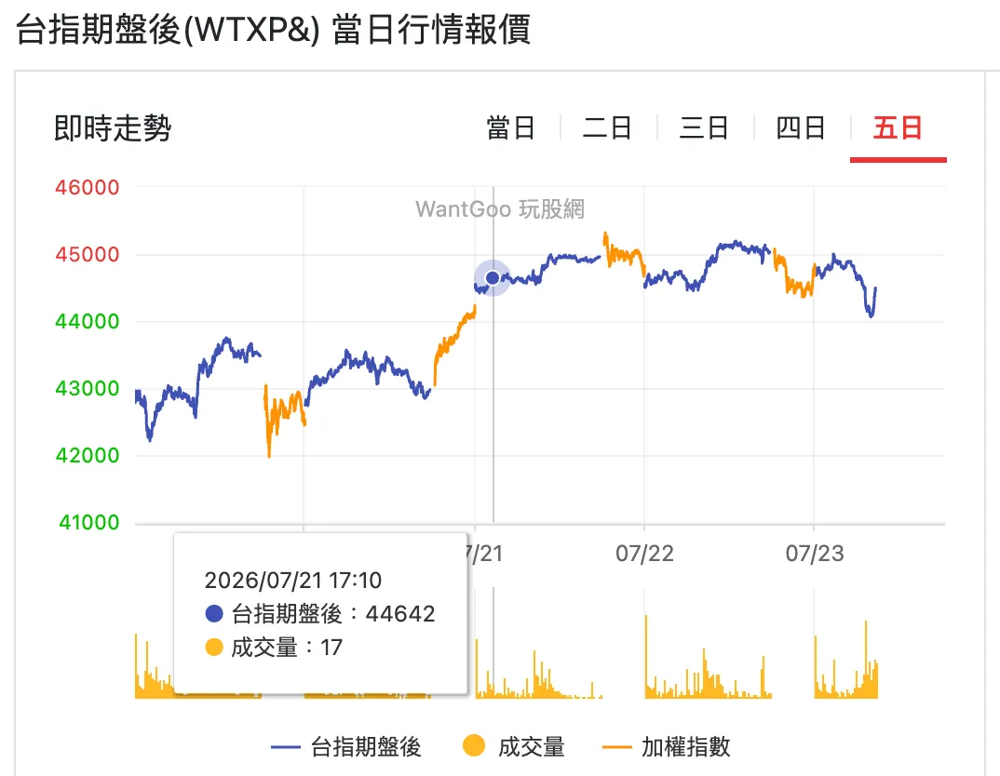
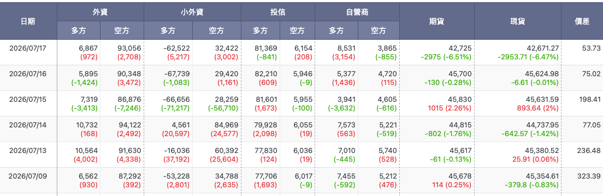

import BookmarkCard from '../../../../components/BookmarkCard.astro';

台指期全名是「臺灣加權股價指數期貨」，是一種以**大盤指數**為標的的期貨合約。你不是買某一檔股票，而是直接對「加權指數會漲還是會跌」下注。

<BookmarkCard title="台指期盤後(WTXP&) 當日行情報價" href="https://www.wantgoo.com/futures/wtxp&" />

---

## 基本規格

| 項目 | 大台（TX） | 小台（MTX） |
|------|-----------|-----------|
| 每點價值 | 200 元 | 50 元 |
| 保證金（原始） | 約 20 萬左右 | 約 5 萬左右 |
| 契兩約月份 | 近月、次月與季月 | 同 |

保證金會隨指數波動由期交所調整，實際數字要看最新公告。

**每點價值的意思**：大台指數漲 100 點，你的部位就賺 100 × 200 = 2 萬元；跌 100 點就賠 2 萬。以目前指數約 4.2 萬點計算，一口大台的合約價值高達 840 萬元，但你只需要放 20 萬保證金——**槓桿約 40 倍**。

---

## 跟股票最大的四個差異

**1. 可以做空，而且和做多一樣容易。** 看壞大盤直接放空，不需要借券。這是台指期最常見的用途——手上有一堆持股又不想賣，就放空台指期避險（你之前查到「外資期貨避險套利」講的就是這個）。

**2. 有到期日。** 每個月第三個星期三結算，時間到自動用結算價平倉，不能像股票一樣無限期抱著。想續抱要「轉倉」到下個月合約。

**3. 有夜盤。** 日盤 8:45–13:45，夜盤 15:00 到隔天凌晨 5:00。所以美股大跌時，台指期夜盤會即時反映，隔天台股開盤前你就知道大概要開低多少——**夜盤是很好用的領先指標**，即使不交易也值得看。

**4. 保證金不足會被強制平倉。** 這是最致命的差異。股票套牢可以凹，期貨不行：權益數低於維持保證金會收到追繳，跌破 25% 直接砍倉。7/17 那種單日 2953 點的行情，一口大台就是 59 萬的價差——遠超過 20 萬的保證金，做多的人當天就爆倉了。

---

## 🔶個實用價值（即使不交易）

**看外資期貨未平倉。** 每天收盤後期交易所會公布三大法人的期貨部位，外資淨空單大增通常是避險加碼的訊號，淨空單減碼常領先現貨買超 1–2 週。這正是你之前問「外資何時回補」時，我提到可以盯的其中一個信號。

**看夜盤與台積電 ADR。** 這兩個合起來，能讓你在早上 9 點開盤前，對台股當天的開盤位置有八成把握。

→ <BookmarkCard href="https://www.moneydj.com/us/tool/tool0001" />

---

⚠️ 台指期槓桿高達數十倍，虧損可能超過本金，跟你目前在做的個股研究是完全不同的風險等級。如果考慮參與，建議先從小台或微台開始，並確保理解保證金追繳機制。以上不構成投資建議。

## 🔶實戰：以 26/7/17 崩盤6%為例

# 從期貨未平倉看懂三大法人多空勢力

2026/7/17，台股單日重挫 2,953 點（-6.47%），創史上最大跌點。當天收盤後的期貨未平倉資料，正好是一份檢視「大資金底牌」的完美教材。本文用這份數據說明：三大法人的部位該怎麼讀、以及市場轉好前會出現哪些可驗證的訊號。

<BookmarkCard href="https://www.wantgoo.com/futures/institutional-investors/net-open-interest" title="台指期貨法人多空未平倉" />

### 一、三大法人各代表什麼

**外資是方向盤，但要扣掉避險成分。** 外資期貨淨部位是三者中最具方向意義的指標。7/17 當天外資多方僅 6,867 口、空方高達 93,056 口，淨空單約 8.6 萬口，且在崩盤當日仍加碼約 1,700 口——歷史上淨空單 3 萬口即屬波段警戒，8.6 萬口是極端水位。但必須注意：外資期貨空單有相當比例是現貨持股的避險，不能直接等同「看空台股」。判別方法是搭配現貨買賣超交叉驗證——現貨同步大賣，空單偏真實看空；現貨買超，空單偏避險。上半年外資賣超 8,356 億元但資金淨匯入 2.44 兆創新高，正說明「賣股」與「撤離」是兩回事。

**投信是結構性多單，參考價值最低。** 投信多方未平倉約 8.1 萬口且長期變動極小，主要對應台股 ETF 規模成長所衍生的部位需求，屬於「不得不持有」的結構性多單，而非主動看多的表態。把它解讀為與外資對作的「護盤大軍」，會高估其方向意義。

**自營商是短線溫度計。** 自營商進出快、部位小，趨勢參考性低，但在極端行情中有領先意義：7/17 崩盤當天自營商多方逆勢大增 3,154 口、空方減碼 855 口，是全表唯一在恐慌中站上多方的法人，屬於典型的跌深搶反彈訊號——可作短線止跌線索，不可當趨勢依據。

### 二、價差：最被低估的情緒指標

期現貨價差（期貨減現貨）反映市場對未來的溢價。7/9 至 7/17，正價差從 +323 點一路收斂至 +53 點，樂觀溢價被抽掉八成以上，量化呈現了多方信心的瓦解過程。但尚未翻成逆價差，代表恐慌仍未到極致——歷史經驗上，深度逆價差出現後再翻正，往往才是波段底部的特徵。

### 三、市場轉好的驗證清單

轉折不會靠單一訊號確認，以下條件同時滿足越多，可信度越高：

1. **外資淨空單明顯回補**——單日減碼萬口以上或連續數日回補（=買進=平倉or做多），是最直接的棄守訊號，通常領先現貨買超一至二週。
2. **價差由逆價差翻回正價差**——恐慌出清後的溢價重建。
3. **外資現貨由賣轉買**——期現貨同步翻多，避險說與看空說才能分辨。
4. **量價止穩**——爆量長黑後量縮價穩，代表賣壓竭盡；再爆量下跌則賣壓未完。

## 結語

期貨未平倉表的價值不在預測點位，而在辨識「大資金此刻站在哪一邊、態度是否改變」。

以 7/17 的數據結構而言：外資淨空單處於歷史極端且未見回補、價差持續收斂但未至逆價差，中期風險訊號仍亮紅燈；自營商轉多僅支持技術性反彈。

在上述驗證清單至少出現兩至三項之前，任何反彈都應以短線逃命波看待，而非趨勢反轉。

*本文為籌碼判讀方法整理，不構成投資建議。*