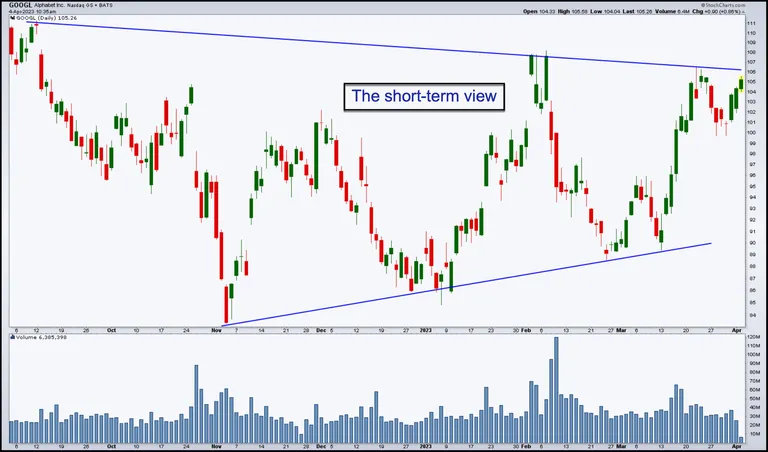
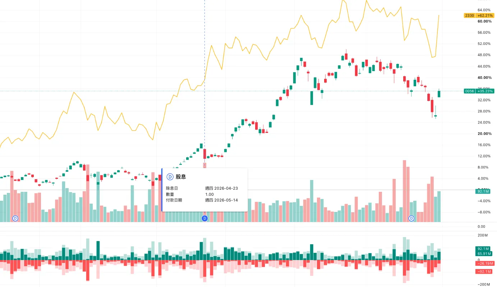
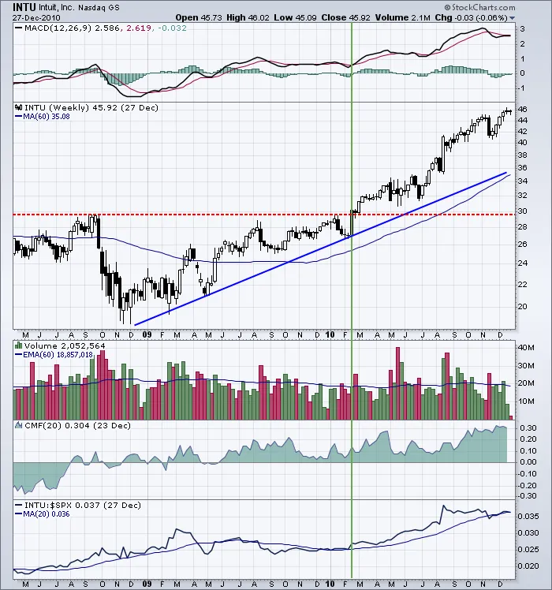
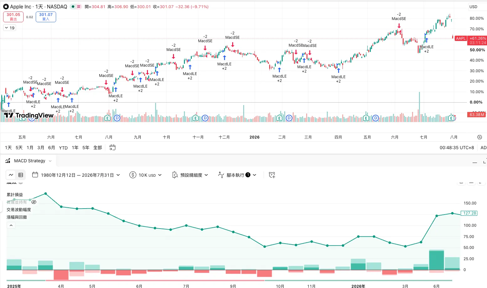
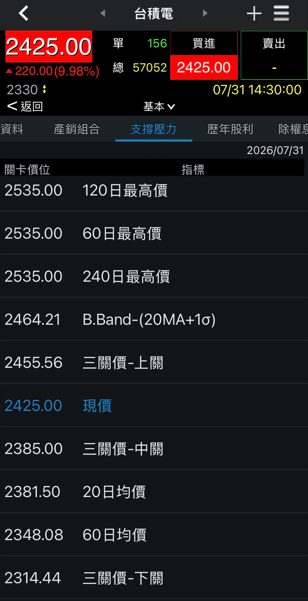

import BookmarkCard from '../../../../components/BookmarkCard.astro';
import { Badge } from '@astrojs/starlight/components';

source: <BookmarkCard href="https://chartschool.stockcharts.com/table-of-contents/overview/technical-analysis" />

---

:::tip[閱畢測驗 TEST！]

Q1：0056 在除息當天大跌、線圖上還跌破了均線，這是該停損的技術訊號嗎？

不是。這屬於「人為的價格變動」，是技術分析三個前提之一的例外——除權息、股票分割都會讓線圖失真。必須先把歷史股價「還原權值」再分析，否則均線、支撐壓力全部會誤判。同理，遇到換管理層、法規、地緣政治這類極端消息，也要等線圖沉澱出新常態再看。

Q2：技術分析的標準流程是「大盤 → 類股 → 個股」，為什麼不能反過來直接從個股開始挑？

因為技術分析的優勢在「相對強弱」。先定大盤方向，再找最強類股，最後在強勢族群裡挑最強個股，是層層過濾出「強中之強」。反過來從個股起手，容易挑到逆勢的孤股——大盤與類股走弱時，單一個股再強也難獨善其身，而且你無從判斷它究竟跑贏還是跑輸大盤。

Q3：文章提到「50 日均線抓 IBM 的支撐壓力很準，換一檔可能要 70 日才準」，MACD 的經典參數 (12, 26, 9) 也未必適合台股。這說明了什麼？

原則通用，參數不通用。支撐、壓力、趨勢、盤整的概念放諸任何標的與任何週期都成立，但每檔股票、每個市場都有自己的脾氣。所以指標不是真理，直接套用預設參數而不驗證，等於拿別人市場的經驗來交易自己的標的。這也正是技術分析「比較像藝術而非科學」的地方。

:::

## 什麼是 技術分析（Technical Analysis）？

技術分析是根據過去的價格走勢，來預測未來的價格變化。它比較像「天氣預報」而非精準預言——不會給你絕對答案，而是幫你判斷價格「比較可能」往哪個方向走。

### 應用

只要價格由供需決定的商品，都能用技術分析：股票、指數、商品、期貨皆可。分析的原料是「價格行為」——開盤、最高、最低、收盤、成交量、未平倉量的組合，時間尺度可以是 1 分、5 分、日、週、月，短則數小時、長則數年。

> Daily chart of Alphabet Inc. (GOOGL) shows a short-term view of the stock's price action.

### 三個關鍵前提

技術分析要有效，標的必須符合三個條件：

- **流動性充足**：成交量大才能順利進出。冷門股買賣盤稀少、價格易被操縱，不適合技術分析。
- **沒有人為的價格變動**：除權除息、分割會讓線圖失真，需先還原歷史股價再分析。
- **沒有極端消息**：技術分析無法預測突發事件（換管理層、法規變動、地緣政治）。遇到這類「極端新聞」，只能耐心等線圖沉澱、反映出「新常態」後再看。

> 0056 除息日下跌

## 理論基礎

現代技術分析源自二十世紀初的**道氏理論（Dow Theory）**，由 Charles Dow 的著作彙整而成。其中三個核心命題最為關鍵：

### 價格反映一切

當前價格已經充分反映所有已知資訊。市價是所有市場參與者（投資人、經理人、分析師…）集體知識的總和，因此價格本身就是分析的起點。技術分析要做的，是解讀價格在說什麼，藉此形成對未來的看法。

### 價格波動並非全然隨機

多數技術派認為價格會「形成趨勢」，但也承認有時價格並不趨勢。市場常是「長時間的隨機波動，中間夾雜較短的非隨機（趨勢）時段」——技術分析者的任務，就是辨識出那些成趨勢的時段並順勢operating。（這正是學術上最被驗證的「動量因子」的實戰版本。）

### 「是什麼」比「為什麼」重要

"What" Is More Important Than "Why"

技術派只關心兩件事：現在價格是多少？過去走勢如何？價格是供需交戰的最終結果，漲就是買方多於賣方，如此而已。基本派糾結「為什麼」，技術派認為理由太廣且常不可靠，專注在「是什麼」更直接。

## 操作步驟

多數技術分析採「由上而下」：**先看大盤，再看類股，最後看個股**。技術原則具有普遍性——支撐、壓力、趨勢、盤整這些概念，套在任何標的、任何週期都通用，不需要經濟學或會計學位。但通用不等於簡單，要做好仍需認真鑽研。

### 線圖分析基礎

以尋找「偏多訊號」為例，基本步驟是：

- **整體趨勢（Overall Trend）**：用趨勢線、均線或高低點結構判斷。價格在上升趨勢線或均線之上、且高點低點同步墊高，即為上升趨勢。
- **支撐（Support）**：前低與盤整區位於現價下方，構成支撐；跌破支撐偏空。
- **壓力（Resistance）**：前高與盤整區位於現價上方，構成壓力；突破壓力偏多。
- **動能（Momentum）**：常用 MACD 等震盪指標衡量。MACD 在其 9 日均線之上或為正值，動能偏多。<Badge text="蝸牛：MACD 不一定適合台股。MACD 的經典參數 (12, 26, 9) 是幾十年前針對美股市場環境設定的。見下方圖" variant="default" />
- **買賣壓力（Buying/Selling Pressure）**：用含成交量的指標判斷。（你判斷漲停真假、賣壓竭盡，用的就是量價。）
- **相對強弱（Relative Strength）**：把個股除以大盤（如 S&P 500），判斷它是跑贏還是跑輸大盤。

最後綜合以上，**評估：趨勢強度、趨勢所處階段、風險報酬比、以及可能的進場位置**。

> AAPL - MACD 指標

> APP 可看支撐與壓力

### 由上而下的分析流程

1. **大盤分析**：先看 S&P 500、道瓊、那斯達克等主要指數。
2. **類股分析**：找出最強與最弱的族群。
3. **個股分析**：在強勢族群中挑最強的個股。

從每個產業選 10–20 檔，篩到 3–4 檔最有潛力者，層層過濾，最後留下「強中之強」。（這套「大盤→類股→個股」的漏斗，就是你在做功率半導體選股時的框架。）

## 優點

### 聚焦價格

**要預測未來價格，直接看價格最合理。價格走勢通常領先基本面**——市場一般領先經濟約六到九個月。重大波動前往往有徵兆：技術派把「量能累積（accumulation）」視為即將上漲的證據，把「量能派發（distribution）」視為即將下跌的訊號。

### 供需與價格行為

單看開高低收各自意義有限，合起來就能反映供需力道。以一根「開高走低」的 K 棒為例：**跳空開高代表買盤強、盤中高點反映需求、盤中低點反映供給、收盤是雙方最終共識價**。若收在接近低點，代表當天買氣雖強，最終仍被賣方壓下。簡言之，價漲反映需求增加，價跌反映供給增加。

### 支撐與壓力

盤整區（交易區間）代表供需僵持。一旦價格突破區間上緣，代表需求勝出；跌破下緣，代表供給勝出。

### 圖像化的價格歷史

即使是基本派，線圖也極有價值。它比一堆數字好讀，能一眼看出：重大事件前後的反應、過去與當前的波動度、歷史量能、以及個股相對大盤的強弱。

### 協助抓進場點

有些人「**用基本面決定買什麼，用技術面決定何時買**」。等突破壓力再進、或在支撐附近承接，都能改善報酬。同時也要看價格歷史：若一檔股票你看好兩年、它卻盤整兩年，代表市場有不同看法；漲多了不妨等回檔，跌勢中則**等買盤和趨勢反轉出現**再說。

## 缺點

### 分析者的偏見

技術分析是主觀的，個人立場會滲進判斷。長期樂觀者會有偏多濾鏡，長期看空者則有偏空傾向，看圖時要對自己的偏見保持警覺。

### 開放式解讀

同一張圖，兩個技術派常畫出兩套劇本、看出不同型態，各自都能找到「合理」的支撐壓力來自圓其說。**技術分析比較像藝術而非科學——杯子是半空還是半滿，全看解讀者**。

### 太慢（訊號滯後）

技術分析常被批評「太晚」：等趨勢被確認，行情往往已走了一大段，此時的風險報酬比並不好。道氏理論尤其常被詬病滯後。

### 永遠有下一個關卡

即使趨勢確立，附近總有另一個「重要價位」。技術派因此被批評騎牆、不敢明確表態——就算看多，也總有某個指標或某個價位讓他保留態度。

### 訊號未必管用（交易者的懊悔）

不是所有型態和指標都會應驗。頭肩頸線跌破是賣訊，但這條規則並不鐵板一塊，還受量能、動能影響。而且對 A 股有效的參數，對 B 股未必適用：50 日均線抓 IBM 的支撐壓力很準，換一檔可能 70 日才準。原則雖然通用，每檔股票仍有自己的脾氣。（這正是亞當理論作者 Wilder 最終想說的——別把指標當真理。）

## 缺點 (2)
<BookmarkCard href="https://www.investopedia.com/terms/t/technicalanalysis.asp" />

* **效率市場假說** （EMH）：批評者認為過去的價格資訊無法提供未來的獲利預測。
* **自我實現預言** （Self-fulfilling Prophecy）：部分型態運作有效，僅是因為大量交易者使用相同的訊號（例如突破 200 日均線觸發停損買賣單），而非預測本身精準。
* **隨機漫步理論** ：價格變動有時更接近隨機漫步，歷史型態不一定會完全重演。

## 結語

技術派認為市場**八成心理、兩成邏輯**；基本派認為兩成心理、八成邏輯。孰是孰非可以辯論，但價格本身無庸置疑——它公開、透明，反映所有參與者的集體知識。透過觀察價格行為、判斷供需哪一方佔上風，技術分析直指核心三問：**價格是多少？曾經在哪裡？將往哪裡去？**

技術分析有通則、也有規則，但它終究更像藝術而非科學，開放解讀、也保有彈性。每個人應只採用適合自己風格的部分。培養出自己的風格需要時間、努力與投入，但回報可能相當可觀。
