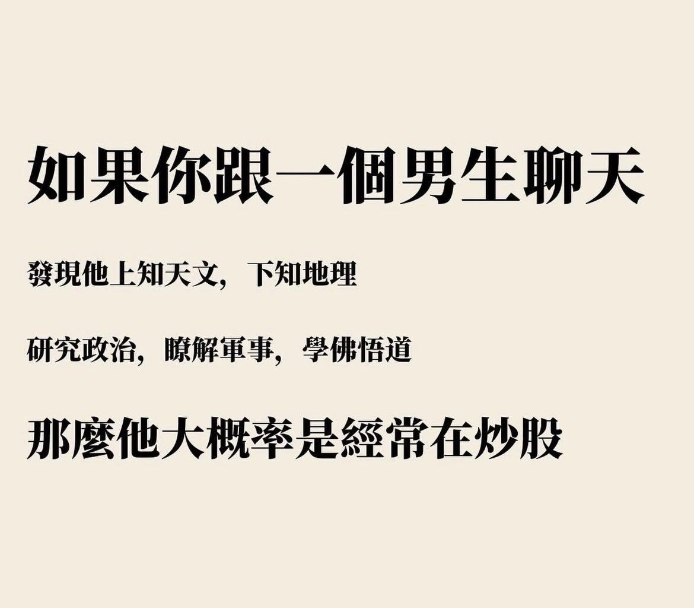

(No，不只男生，我們women也是)

梗圖來源：芭樂 thread - `notetoself_journal_`

## why
* \$\$
* 其實投資的人，比我們想像得還多
* 不過，大家都在投什麼？大盤vs個股

### 預防針
* 也很多怪人（開口閉口談錢、窮得只剩下錢、無法掌控情緒的賭徒）

## 怎麼投
1. 追很多news、情報？但無用的情報是noise、新聞到大眾手上已經延遲了
2. 基本面（長期
3. 技術面
4. 短期有難以預測的市場情緒
5. 資產配置
6. 是投資還是投機？有把握還是單純的賭博？

## 如何學習
* 資訊品質參差、快速、過多
* 如何驗證有效性：回測
* 如何確實學會（真正消化）？不能只是紙上談兵。內化方法-output

## 頻道分享（有正確投資心態）
* 股癌（全台最大 podcast）
* 腦哥（區塊鏈）

## 今天實戰

[法人說明會：台積電-26Q1](/posts/finance-reports/tsmc-26q1/)